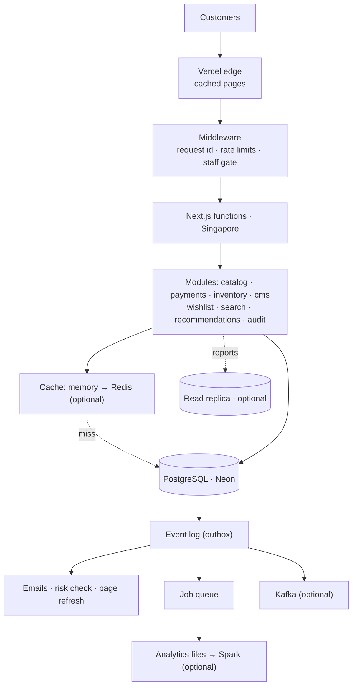

# Avyora

The online shop for Avyora, a science-forward skincare brand for the Indian
market: storefront, checkout, customer accounts, an operations console for the
owner, a stockroom console for staff, and a content editor (CMS).

- **Live site:** https://avyora-beauty.vercel.app
- **Architecture, with diagrams:** https://claude.ai/artifact/GofPetHk7VAGonL1Reu23K
- **Stack:** Next.js 15 on Vercel · PostgreSQL 18 on Neon (Singapore) · no other
  servers to run

This README is the owner's manual. It covers signing in, editing content,
changing passwords, how the system fits together, how to grow it, and what to
build next.

---

## Contents

1. [Signing in: admin, CMS and stockroom](#1-signing-in-admin-cms-and-stockroom)
2. [Changing a password, adding or removing staff](#2-changing-a-password-adding-or-removing-staff)
3. [Using the CMS](#3-using-the-cms)
4. [The operations console, page by page](#4-the-operations-console-page-by-page)
5. [How it works](#5-how-it-works)
6. [Running it on your computer](#6-running-it-on-your-computer)
7. [Database and migrations](#7-database-and-migrations)
8. [Environment variables](#8-environment-variables)
9. [Deploying](#9-deploying)
10. [Scaling it forward](#10-scaling-it-forward)
11. [What you can build next](#11-what-you-can-build-next)
12. [Testing](#12-testing)
13. [Troubleshooting](#13-troubleshooting)
14. [Further reading](#14-further-reading)

---

## 1. Signing in: admin, CMS and stockroom

There is one sign-in page for all staff:

**https://avyora-beauty.vercel.app/admin-login**

| Who | Signs in with | Lands on | Can use |
| --- | --- | --- | --- |
| **Owner** | `ADMIN_USERNAME` / owner password | `/admin` | Everything: orders, stock, **prices**, **content (CMS)**, analytics, system |
| **Manager** (optional) | `MANAGER_USERNAME` / manager password | `/manager` | The stockroom only: packing, dispatch, stock counts, restock requests |

The CMS is part of the owner's console, at **`/admin/content`**. There is no
separate CMS login; the owner account opens it.

### Where the password is

- The **username** is the `ADMIN_USERNAME` environment variable in Vercel
  (Project → Settings → Environment Variables). The password script sets it to
  `admin` unless you changed it.
- The **password itself is stored nowhere** in the code, the repository or
  Vercel. Only a one-way hash of it (`ADMIN_PASSWORD_HASH`) is stored, which
  cannot be turned back into the password.
- When the owner account was set up, the password was saved on this computer at
  `Desktop/avyora-admin-password.txt`. **Move it into a password manager and
  delete the file.** Anyone who can read that file can run the shop.
- If the password is lost, it cannot be recovered. Set a new one (next section).

Staff sessions last 8 hours. Five wrong attempts from one address are
rate-limited for 15 minutes. With no password configured at all, every sign-in
is refused: the console **fails closed**, not open.

---

## 2. Changing a password, adding or removing staff

Passwords are set through environment variables, so changing one means
generating a new hash and redeploying. It takes about three minutes.

### Change the owner password

1. On your computer, in this folder:

   ```bash
   node scripts/hash-password.mjs 'your-new-password-at-least-12-characters'
   ```

   It prints three lines: `ADMIN_USERNAME`, `ADMIN_PASSWORD_HASH` and
   `SESSION_SECRET`.

2. In Vercel → Project → Settings → Environment Variables, replace the value of
   **`ADMIN_PASSWORD_HASH`** (Production environment) with the new one.
   Replace `ADMIN_USERNAME` too if you want a different username.

3. Redeploy: Vercel → Deployments → the latest production deployment → ⋯ →
   **Redeploy**. Environment changes only apply to new deployments.

4. Sign in at `/admin-login` with the new password.

You do **not** need to change `SESSION_SECRET` for a normal password change.
Change it (to the new value the script printed) only if you think someone has
stolen a session. Changing it signs out every staff member and every customer
who signed in with an email code.

### Add a stockroom manager

1. Run the same script with the manager's password:

   ```bash
   node scripts/hash-password.mjs 'managers-own-password'
   ```

2. In Vercel, add **`MANAGER_USERNAME`** (a name of your choice, for example
   `stockroom`) and **`MANAGER_PASSWORD_HASH`** (the `ADMIN_PASSWORD_HASH` line
   the script printed). Ignore the other two lines it prints.
3. Redeploy. The manager signs in at the same `/admin-login` page.

### Remove a manager

Delete `MANAGER_USERNAME` and `MANAGER_PASSWORD_HASH` in Vercel and redeploy.
Staff credentials are re-read on every request, so the manager is locked out
as soon as the new deployment is live, even if still signed in.

### Rules the script enforces

- At least 12 characters. Use a long passphrase; a password manager can make one.
- The hash uses PBKDF2-SHA256 with 210,000 iterations.
- Never commit a hash or a password to git. `.env*` files are ignored for this
  reason.

---

## 3. Using the CMS

Open **`/admin/content`** after signing in as the owner.

### What you can edit

| Content | Where it appears | Fields |
| --- | --- | --- |
| **Product copy** (one per product) | The product's page | Tagline, description, "How to use", up to 6 highlights |
| **Journal articles** | `/journal` and `/journal/<address>` | Title, excerpt, body, hero image |
| **Media library** (`/admin/content/media`) | Article hero images | JPEG, PNG, WebP or AVIF up to 4 MB |

Names, sizes, ingredients and categories come from the product catalogue
(`src/data/mock-data.ts`) and change with a code deploy. **Prices and stock are
not in the CMS**: set them under Pricing and Inventory.

### How editing works

1. **Save draft.** Nothing changes on the shop. Drafts are private. A product
   with no edits yet starts from its catalogue text.
2. **Publish version N.** The shop shows this version within seconds. Pages
   refresh automatically.
3. **Take down.** The shop goes back to the catalogue text (products) or the
   article disappears (journal).
4. **History.** Every save and publish is kept. **Restore as draft** brings an
   old version back as a new draft; it does not go live until you publish it.

Two things protect you from mistakes:

- **Someone else saved first.** If two people edit the same item, the second
  save is refused with a message instead of silently overwriting the first
  person's work. Reload, then redo your change.
- **Publish means "what I reviewed".** The publish button names a version
  number. If a newer draft was saved in the meantime, publishing is refused, so
  you never publish text you haven't seen.

### Writing articles

The body is plain text:

- Leave a **blank line** between paragraphs.
- Start a line with `## ` for a **subheading**.
- HTML is shown as text, never run, so pasting from elsewhere cannot break the
  page or inject scripts.

The article's address (for example `monsoon-skin-routine`) uses lower-case
letters, numbers and single hyphens, and cannot be changed after the first
save.

### Images

Uploads need object storage, and **production has none configured yet**, so the
media page says "Uploads are off". To turn them on, see
[Scaling → object storage](#stage-2--make-it-robust-free-or-almost-free). On
your own computer, uploads work and are saved to `public/media-local/`.

Every change (save, publish, take down, restore, upload) is written to the
audit log with who did it and when.

---

## 4. The operations console, page by page

| Page | What it is for |
| --- | --- |
| **Overview** `/admin` | Today's orders, revenue actually paid, what's waiting, low and out-of-stock counts |
| **Orders** `/admin/orders` | Every order. Change status, release or cancel cash-on-delivery orders held by the risk check, and resolve orders flagged **"Needs your decision"** (a payment that arrived after the stock was released, an amount mismatch). Resolving needs a written note. |
| **Inventory** `/admin/inventory` | Set stock counts and allow backorders. If someone else changed a count while you were typing, your save is refused and you are shown the new number. |
| **Pricing** `/admin/pricing` | Normal price and offer price per size, offer label and end date. Enter rupees. Offers end automatically. |
| **Content** `/admin/content` | The CMS (section 3) |
| **Analytics** `/admin/analytics` | Sales by product and by day, and a reorder estimate. Cancelled and refunded orders are excluded. |
| **Requests** `/admin/requests` | Restock requests raised by the stockroom |
| **System** `/admin/system` | Background work: queued and failed jobs, failed deliveries (emails, alerts) with a **Replay** button, cache and database-read counters |
| **Stockroom** `/manager` | The packing and dispatch view, which the owner can open too |

**About the System page.** Anything shown as **dead** was retried several times
and gave up. Fix the cause first (for example an email provider key), then
press **Replay**. Replays are recorded in the audit log.

---

## 5. How it works

The one-paragraph version: it is a single Next.js application split into
modules. **PostgreSQL is the only source of truth.** Everything else (the cache,
the event stream, the analytics files, the search index) is a copy of it or sits
in front of it, and can be lost without losing an order.



### The rules that keep money and stock right

| Promise | How it is kept |
| --- | --- |
| Never sell more than is on the shelf | Stock is reserved with a guarded update inside the order's own transaction |
| No double orders from a double click or a retry | Each checkout carries an idempotency key, enforced by a unique index |
| The price shown is the price charged | Display and checkout use the same pricing rule. Checkout always reads fresh prices from the database, never from a cache. |
| A payment is applied once | Every Razorpay event is recorded under its own id; duplicates are ignored |
| A paid order cannot be un-paid by accident | A payment state machine decides every change, with the order row locked |
| Nothing is lost if an email provider is down | Side effects run from the event log with retries, after the order is saved |
| Every admin change is traceable | Prices, stock, content and order changes write an audit row in the same transaction |

These were checked under real contention against PostgreSQL, not just in unit
tests. See [`docs/stress-testing.md`](docs/stress-testing.md).

### Where things live in the code

```
src/
  app/              pages and routes (App Router)
    admin/          owner console, including admin/content (CMS)
    manager/        stockroom console
    api/            the 12 HTTP endpoints: webhooks, cron, payments, cart…
    journal/        published articles
  modules/          business logic by area (newer code)
    payments/       state machine, webhook handling, reconciliation
    cms/            content types, commands, reads, media
    catalog/        pricing rule, display prices
    inventory/      stock commands
    search/ recommendations/ analytics/ audit/ wishlist/ ai/
  infrastructure/   shared plumbing
    cache/          memory + Redis tiers, policies
    commands/       validate → authorise → transaction → audit
    idempotency/    run-once-per-key
    jobs/           Postgres job queue and worker
    storage/        S3-compatible and local object storage
    streaming/      Kafka producer
  lib/              older modules: orders, events, auth, cart…
  db/               schema, connection, read routing
  data/mock-data.ts the product catalogue
drizzle/            database migrations (0000–0013)
scripts/            passwords, migrations, seeding, load test
analytics/          Spark reference job and data-platform notes
docs/               design documents
```

---

## 6. Running it on your computer

```bash
npm install
cp .env.example .env.local     # then fill in what you need
npm run dev                    # http://localhost:9002
```

For a local database, point `DATABASE_URL` in `.env.local` at a **Neon branch**,
never at production. Create one in the Neon console from `main` (Branches → New
branch), then run `npm run db:migrate`.

| Command | What it does |
| --- | --- |
| `npm run dev` | Development server on port 9002 |
| `npm run build` / `npm start` | Production build, then serve it on port 3000 |
| `npm run typecheck` · `npm run lint` · `npm test` | Checks, as CI runs them |
| `npm run db:migrate` | Apply pending migrations to `DATABASE_URL` |
| `npm run db:seed-inventory` | Create stock rows for any catalogue size that has none |
| `npm run check:env -- --production` | Check environment variables before a deploy (never prints secrets) |
| `npm run test:stress` | Concurrency tests against a scratch database (see section 12) |
| `npm run load-test -- http://localhost:3000` | HTTP load test against a local build |

---

## 7. Database and migrations

- **Where:** Neon project `neon-violet-school`, branch `main`, region
  ap-southeast-1 (Singapore), PostgreSQL 18.
- **Schema:** `src/db/schema.ts`, with 33 tables. Each change is a numbered SQL
  file in `drizzle/`, applied in order and recorded, so running migrations twice
  is harmless.

### Making a schema change

```bash
# 1. Edit src/db/schema.ts
npm run db:generate                       # 2. writes drizzle/00NN_*.sql — read it
DATABASE_URL='<a Neon branch>' npm run db:migrate   # 3. try it on a branch first
# 4. Once it works there, apply to production (below)
```

### Applying migrations to production

Use the **direct** connection string for migrations: the host **without**
`-pooler`. Before any migration, make a restore point: in Neon, create a branch
from `main` named `pre-migration-<date>`. It is instant and free, and it is a
full copy to go back to.

```bash
DATABASE_URL='<production direct URL>' npm run db:migrate
```

Prefer migrations that only **add** things (tables, nullable columns, indexes).
Old and new code can then both run against the new schema while a deploy rolls
out.

### Backups: read this

Neon's free plan keeps **6 hours** of point-in-time restore and **no scheduled
snapshots**. A mistake noticed the next morning cannot be undone from Neon
alone. A daily encrypted backup is written and waiting in
`.github/workflows/backup.yml`, but it **runs only once you add its secrets**.
See [Scaling → Stage 1](#stage-1--do-this-now-free).

---

## 8. Environment variables

Set these in Vercel → Project → Settings → Environment Variables. The full list
with comments is in [`.env.example`](.env.example). Run
`npm run check:env -- --production` to check them.

**Required**

| Variable | What |
| --- | --- |
| `DATABASE_URL` | Neon **pooled** connection string (host contains `-pooler`) |
| `SESSION_SECRET` | Signs staff and email-code sessions |
| `ADMIN_USERNAME`, `ADMIN_PASSWORD_HASH` | Owner sign-in |
| `AUTH_SECRET`, `AUTH_GOOGLE_ID`, `AUTH_GOOGLE_SECRET` | Customer Google sign-in |
| `CRON_SECRET` | Protects the two daily scheduled jobs |

**Turns features on (optional)**

| Variable | Turns on |
| --- | --- |
| `MANAGER_USERNAME`, `MANAGER_PASSWORD_HASH` | A stockroom login |
| `RAZORPAY_KEY_ID`, `RAZORPAY_KEY_SECRET`, `RAZORPAY_WEBHOOK_SECRET` | Card, UPI and netbanking. Without them, cash on delivery only. |
| `RESEND_API_KEY`, `EMAIL_FROM` | Order and sign-in emails (needs a verified domain) |
| `OWNER_EMAIL` | Where new-order alerts for the owner are sent |
| `WHATSAPP_TOKEN`, `WHATSAPP_PHONE_NUMBER_ID`, `WHATSAPP_TO`, `WHATSAPP_TEMPLATE`, `WHATSAPP_TEMPLATE_LANG` | WhatsApp new-order alerts to the owner (Meta Cloud API) |
| `REDIS_REST_URL`, `REDIS_REST_TOKEN` | Shared cache (Upstash) |
| `STORAGE_S3_*`, `STORAGE_PUBLIC_BASE_URL` | Image uploads in the CMS |
| `STORAGE_ANALYTICS_BUCKET` | Daily analytics export |
| `DATABASE_READ_URL` | Read replica for reports |
| `KAFKA_REST_URL`, `KAFKA_CLUSTER_ID`, `KAFKA_API_KEY`, `KAFKA_API_SECRET` | Event streaming |
| `SENTRY_DSN`, `NEXT_PUBLIC_SENTRY_DSN` | Error reporting |

---

## 9. Deploying

- **Preview:** every push to a branch gets its own preview URL on Vercel.
- **Production:** merging into `main` deploys to production.
- **Functions** run in `sin1` (Singapore, next to the database), set in
  `vercel.json`. Before this, they ran in Washington, D.C.: roughly 200 ms per
  database query.
- **Scheduled jobs** run twice daily (`vercel.json`): the reservation sweep at
  03:15 UTC and background work at 03:45 UTC. Vercel's free plan allows only
  once-a-day schedules.

Checklist for a deploy that changes the database:

1. Restore-point branch in Neon.
2. Apply migrations to production (section 7).
3. Merge to `main`.
4. Watch Vercel's runtime logs and `/admin/system` for the first hour.

The full first-launch walkthrough is in [`docs/deploy.md`](docs/deploy.md).

---

## 10. Scaling it forward

The app is built to grow by **switching things on**, not by rewriting. Each
stage below is a set of settings and accounts, in order of value.

### Stage 1 — do this now (free)

| Do | Why |
| --- | --- |
| Move `avyora-admin-password.txt` into a password manager and delete the file | Whoever can read it can run the shop |
| Turn on the daily backup: create a private Cloudflare R2 bucket (free tier), add the six `BACKUP_*` secrets in GitHub → Settings → Secrets → Actions, and set a 30-day expiry rule on the bucket | Neon keeps only 6 hours of history |
| Restore one backup into a scratch Neon branch, then delete the branch | A restore that has never been tried is a hope, not a backup |
| Verify a sending domain in Resend | Order emails currently cannot reach customers |
| Add Razorpay keys, then set the webhook to `https://<your-domain>/api/webhooks/razorpay` | Online payment |

### Stage 2 — make it robust (free or almost free)

| Switch on | How | Effect |
| --- | --- | --- |
| **Shared cache** | Create an Upstash Redis database (free tier), set `REDIS_REST_URL` and `REDIS_REST_TOKEN` | Carts, content and prices are served from Redis across all instances. If it fails, the site falls back to the database automatically. |
| **Image uploads** | An R2 bucket with public access, then set `STORAGE_S3_ENDPOINT`, `STORAGE_S3_BUCKET`, `STORAGE_S3_REGION=auto`, the two keys and `STORAGE_PUBLIC_BASE_URL` | Media library and article images |
| **Analytics export** | A **second, private** bucket, `STORAGE_ANALYTICS_BUCKET` | The event history lands daily as NDJSON, readable by Spark, BigQuery or DuckDB |
| **Custom domain** | Vercel → Domains | Needed for email, and for trust |

### Stage 3 — when orders grow (paid)

| Upgrade | Why | When |
| --- | --- | --- |
| **Vercel Pro** | Frequent schedules: sweep every 15 minutes, background jobs every few minutes. Also allows commercial use, which the free plan does not. | Before real launch |
| **Neon Launch plan** | 7+ days of point-in-time restore, bigger compute (0.25 CU is the current ceiling), autoscaling | Tens of orders a day |
| **Read replica** | Neon → add a read-only compute on `main`, set `DATABASE_READ_URL` | When the analytics pages get slow. Checkout never uses it. |
| **Kafka** | Confluent Cloud, set `KAFKA_*` | When another system needs events in real time (a CRM, a warehouse system) |

### What limits growth, in order

1. **One popular product selling fast.** Each checkout briefly locks that
   product's stock row. With functions next to the database this is a few
   milliseconds per order, which allows hundreds of orders per minute for a
   single product. Far beyond that, split stock into several rows ("stock
   buckets").
2. **Database compute.** Scale the Neon compute before anything else.
3. **The catalogue lives in code.** Past about a hundred products, move it into
   a `products` table so names and sizes can be edited without a deploy (see
   section 11).

What does **not** limit growth: the application tier (Vercel adds instances
automatically) and connection counts (the Neon pooler multiplexes them).

---

## 11. What you can build next

Roughly in order of value for a growing skincare shop.

**Selling**
- **Products in the database, editable in the CMS.** Add, rename and describe
  products without a deploy. The CMS and command patterns are already built
  for this.
- **Reviews and ratings.** The `reviews` table exists; it needs a form after
  delivery and moderation in the console. Structured data is already set up
  to show real ratings in Google.
- **Discount codes and bundles.** Use the same "one pricing rule" module, so
  display and charge stay identical.
- **Back-in-stock alerts.** Needs an email queue job and an `inventory.changed`
  consumer, both of which already exist.

**Customers**
- **Order tracking** through a courier API (Shiprocket, Delhivery).
- **WhatsApp updates for customers.** The owner already gets WhatsApp alerts
  through Meta's API (once its keys are set). Customer updates need an approved
  message template and the customer's consent.
- **Routine reminders**, as scheduled jobs on the queue.

**Intelligence**
- **Skin-photo analysis.** The job type and interface exist
  (`src/modules/ai/skin-analysis.ts`); plug in a vision model. The consent check
  is already enforced.
- **Better search** with a Postgres full-text engine, once products are in the
  database. The search interface is ready for it.
- **Analytics dashboards** from the exported event files (Metabase, BigQuery,
  or the Spark job in `analytics/`).

**Operations**
- **Owner alerts** when something lands in "dead" on the System page.
- **A second admin account**, with per-person audit names.
- **Move to AWS** if ever needed. The code uses plain Postgres, standard S3 and
  a Dockerfile; it is a change of environment variables, not a rewrite.

---

## 12. Testing

| Suite | Command | What it proves |
| --- | --- | --- |
| Unit + integration (403 tests) | `npm test` | Pricing, payments, idempotency, cache, CMS, jobs, search… against a real Postgres engine running in memory |
| Concurrency stress (8 scenarios) | `npm run test:stress` | No oversells, no double charges, no deadlocks, jobs run exactly once, under real contention |
| HTTP load | `npm run load-test -- http://localhost:3000` | Throughput and latency by page; rate limiting engages |

The stress suite **deletes data**, so it refuses to run unless given a scratch
database and an explicit opt-in:

```bash
STRESS_DATABASE_URL='<scratch Neon branch>' \
STRESS_ALLOW_DESTRUCTIVE=yes-this-is-a-scratch-database \
npm run test:stress
```

The load test refuses to target the live site. Point it at a local
`npm run build && npm start`. CI runs typecheck, lint, tests and a dependency
audit on every push.

---

## 13. Troubleshooting

| Symptom | Likely cause | Fix |
| --- | --- | --- |
| Admin sign-in always fails | `ADMIN_PASSWORD_HASH` missing or malformed, or not redeployed after changing it | `npm run check:env -- --production`, then redeploy |
| Everyone was signed out | `SESSION_SECRET` changed | Expected; sign in again |
| Customers get no email | Resend domain not verified, or the key is missing | Verify the domain. Failed emails wait under System → Replay. |
| An order shows unpaid but the customer paid | Webhook delayed or lost | A reconciliation job checks after 20 minutes. If it is still unpaid, look at the order's payment events. |
| "Uploads are off" in the media library | No object storage configured | Section 10, Stage 2 |
| A product edit doesn't show | Saved as a draft, not published | Press **Publish version N** |
| "Someone else saved this…" | Two people edited the same item | Reload, then redo the change |
| Something under System shows **dead** | A provider refused repeatedly | Fix the provider, then press **Replay** |

---

## 14. Further reading

| Document | About |
| --- | --- |
| [Architecture page](https://claude.ai/artifact/GofPetHk7VAGonL1Reu23K) | The whole system with diagrams, and what is and isn't built |
| [`docs/data-architecture.md`](docs/data-architecture.md) | Stores, read replicas, pooling, backups, the restore runbook |
| [`docs/stress-testing.md`](docs/stress-testing.md) | How the system was load- and stress-tested, and the results |
| [`docs/CURRENT_ARCHITECTURE.md`](docs/CURRENT_ARCHITECTURE.md) | The audit that preceded the upgrade |
| [`docs/deploy.md`](docs/deploy.md) | First-time production setup |
| [`docs/security.md`](docs/security.md) | Security decisions and known advisories |
| [`docs/how-to-use.md`](docs/how-to-use.md) | Day-to-day operating notes |
| [`docs/routine-methodology.md`](docs/routine-methodology.md) | How the routine finder decides |
| [`analytics/README.md`](analytics/README.md) | The data platform: export, Kafka, Spark |
