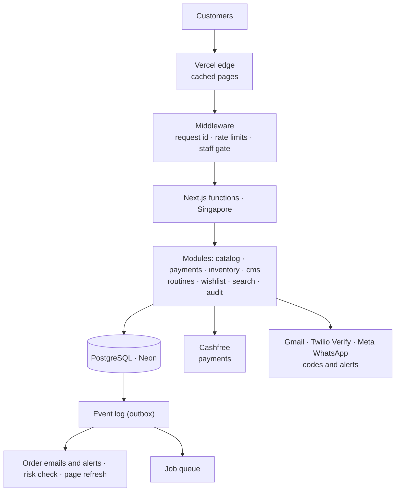

# Avyora

The online shop for Avyora, a skincare brand for the Indian market: a
storefront with a routine finder, checkout with online payment or cash on
delivery, customer accounts, an operations console for the owner, a stockroom
console for staff, and a content editor (CMS).

- **Live site:** https://avyora-beauty.vercel.app
- **Architecture, with diagrams:** https://claude.ai/artifact/GofPetHk7VAGonL1Reu23K
- **Stack:** Next.js 15 on Vercel · PostgreSQL on Neon (Singapore) · Cashfree
  payments · Gmail, Twilio and Meta WhatsApp for messages · no servers of your
  own to run

This README is the owner's manual: how customers sign in and buy, how you are
told about orders, how to run the shop, how the system fits together, and what
to set up next.

---

## Contents

1. [What customers can do](#1-what-customers-can-do)
2. [How you hear about orders](#2-how-you-hear-about-orders)
3. [Signing in: admin, CMS and stockroom](#3-signing-in-admin-cms-and-stockroom)
4. [Changing a password, adding or removing staff](#4-changing-a-password-adding-or-removing-staff)
5. [The operations console, page by page](#5-the-operations-console-page-by-page)
6. [Using the CMS](#6-using-the-cms)
7. [How it works](#7-how-it-works)
8. [Running it on your computer](#8-running-it-on-your-computer)
9. [Database and migrations](#9-database-and-migrations)
10. [Environment variables](#10-environment-variables)
11. [Deploying](#11-deploying)
12. [Launch checklist and scaling](#12-launch-checklist-and-scaling)
13. [Testing](#13-testing)
14. [Troubleshooting](#14-troubleshooting)
15. [Further reading](#15-further-reading)

---

## 1. What customers can do

| Feature | Where | Notes |
| --- | --- | --- |
| **Browse and buy** | `/collections`, `/products/…`, bag drawer, `/checkout` | Pay online through Cashfree (UPI, cards, netbanking, wallets) or cash on delivery |
| **Routine finder** | `/routine-finder` | Fifteen questions → a 7-day morning and evening routine within a budget. Optional private-beta email unlock (section 10, feature flags). |
| **Sign in** | `/login`, `/signup`, header account menu | **Google**, an **email code**, a **mobile (SMS) code**, or email and password. An existing account signs in with Google if the emails match. |
| **Guest checkout** | `/checkout` | No account needed. The guest proves their mobile number: **Get OTP → enter code → Verify**, and the number then locks. |
| **Track an order** | `/track-order`, the link in the order email | Guests reach their order through a signed link |
| **Ask Avyora, journal, wishlist** | `/assistant`, `/journal`, `/wishlist` | |

### Mobile verification at checkout

A guest cannot place an order until the delivery number is verified:

1. They type a 10-digit mobile number and press **Get OTP**.
2. An SMS code arrives; they enter it and press **Verify**.
3. The number greys out and locks, with **Change** to start again.

Verifying gives the browser a signed proof for that one number, valid 8 hours.
The server refuses a guest order whose delivery number has no matching proof,
for cash on delivery and online payment alike, so it cannot be skipped by
calling the site's API directly. Signed-in customers are not asked. On a
deployment with no SMS provider it is not asked either, rather than making
checkout impossible.

### Where sign-in codes come from

| Code | Provider used (first one configured wins) |
| --- | --- |
| Email code | **Gmail** (app password) → Resend |
| SMS code | **Twilio Verify** → Fast2SMS → MSG91 |

With Twilio Verify, Twilio creates, sends and checks the code itself; it needs
no Twilio phone number and no Indian DLT registration. With the others, the
code is the site's own (stored hashed, five attempts, used once, expires in
10 minutes). Sending is limited per number and per network address because
every SMS costs money.

---

## 2. How you hear about orders

Every order sends three messages. None of them can fail an order: they run
after the order is saved, and failures are retried from the System page.

| Message | To | Through | Needs |
| --- | --- | --- | --- |
| Order confirmation with a tracking link | The customer | Gmail (or Resend) | `GMAIL_USER`, `GMAIL_APP_PASSWORD` |
| "New order …" with items and address | `OWNER_EMAIL` | Gmail (or Resend) | the above plus `OWNER_EMAIL` |
| "New order AVY-… — ₹678 (PAID). 1 item to Mumbai." | `WHATSAPP_TO` | Meta WhatsApp Cloud API | `WHATSAPP_TOKEN`, `WHATSAPP_PHONE_NUMBER_ID`, `WHATSAPP_TO` |

### WhatsApp: the 24-hour rule

WhatsApp only lets a business send **free text** within 24 hours of the person
last messaging it. Outside that window it delivers **approved templates** only.

- Set `WHATSAPP_TEMPLATE=avyora_new_order` once Meta approves that template
  (WhatsApp Manager → Message templates). The alert is sent through it and
  arrives at any time.
- Until then, alerts arrive only within 24 hours of you last messaging the
  sending number. Reply "hi" to it to open a window.
- Meta's free test number can only message numbers added to its recipient list
  (Meta app → WhatsApp → Try it out → To → Manage phone number list).

### Health and monitoring

- **`/api/health`** answers `200 {"status":"ok","database":"ok"}`, or `503`
  with `"database":"down"` when the database is unreachable (8-second limit,
  to allow for Neon waking from idle). Point an uptime monitor (Better Stack,
  UptimeRobot, Vercel's own checks) at it.
- **Errors** are written as structured JSON lines (`level`, `scope`,
  `requestId`, with personal data scrubbed) to Vercel's runtime logs.
- **Sentry** is wired in and switches on when `SENTRY_DSN` and
  `NEXT_PUBLIC_SENTRY_DSN` are set: create a free project at sentry.io
  (platform Next.js), copy its DSN into both variables, redeploy. Personal
  data is scrubbed before anything is sent.

### Where the shop's orders appear

- **Admin → Orders**: every order, newest first, with status buttons.
- **Admin → Inventory → Orders to ship**: paid and cash-on-delivery orders not
  yet sent, oldest first. Open one to mark it packed, then shipped.

---

## 3. Signing in: admin, CMS and stockroom

There is one sign-in page for all staff:

**https://avyora-beauty.vercel.app/admin-login**

| Who | Signs in with | Lands on | Can use |
| --- | --- | --- | --- |
| **Owner** | `ADMIN_USERNAME` / owner password | `/admin` | Everything: orders, stock, **prices**, **content (CMS)**, analytics, system |
| **Manager** (optional) | `MANAGER_USERNAME` / manager password | `/manager` | The stockroom only: packing, dispatch, stock counts, restock requests |

The CMS is part of the owner's console, at **`/admin/content`**. There is no
separate CMS login.

### Where the password is

- The **username** is the `ADMIN_USERNAME` environment variable in Vercel
  (Project → Settings → Environment Variables).
- The **password itself is stored nowhere**: not in the code, the repository or
  Vercel. Only a one-way hash (`ADMIN_PASSWORD_HASH`) is stored.
- When the owner account was set up, the password was saved on this computer at
  `Desktop/avyora-admin-password.txt`. **Move it into a password manager and
  delete the file.** Anyone who can read it can run the shop.
- A lost password cannot be recovered. Set a new one (next section).

Staff sessions last 8 hours. Five wrong attempts from one address are
rate-limited for 15 minutes. With no password configured, every sign-in is
refused: the console **fails closed**.

---

## 4. Changing a password, adding or removing staff

Passwords are set through environment variables, so a change means a new hash
and a redeploy. It takes about three minutes.

### Change the owner password

1. In this folder:

   ```bash
   node scripts/hash-password.mjs 'your-new-password-at-least-12-characters'
   ```

   It prints `ADMIN_USERNAME`, `ADMIN_PASSWORD_HASH` and `SESSION_SECRET`.

2. In Vercel → Project → Settings → Environment Variables, replace
   **`ADMIN_PASSWORD_HASH`** (Production) with the new value.
3. Redeploy: Vercel → Deployments → latest production deployment → ⋯ →
   **Redeploy**. Environment changes only apply to new deployments.
4. Sign in at `/admin-login` with the new password.

Do **not** change `SESSION_SECRET` for a normal password change. Change it only
if you think a session was stolen: it signs out every staff member and every
customer, and invalidates guest checkout phone proofs.

### Add or remove a stockroom manager

- **Add:** run the script with the manager's password, then set
  **`MANAGER_USERNAME`** and **`MANAGER_PASSWORD_HASH`** (the hash line the
  script printed) in Vercel, and redeploy.
- **Remove:** delete both variables and redeploy. Credentials are re-read on
  every request, so the manager is locked out as soon as the deploy is live.

The script requires at least 12 characters and hashes with PBKDF2-SHA256
(210,000 iterations). Never commit a hash or a password; `.env*` files are
ignored by git for this reason.

---

## 5. The operations console, page by page

| Page | What it is for |
| --- | --- |
| **Overview** `/admin` | Today's orders, revenue actually paid, what's waiting, low and out-of-stock counts |
| **Orders** `/admin/orders` | Every order. Change status (packed → shipped → delivered), release or cancel cash-on-delivery orders held by the risk check, and resolve orders flagged **"Needs your decision"** (a payment that arrived after the stock was released, an amount mismatch). Resolving needs a written note. |
| **Inventory** `/admin/inventory` | **Orders to ship** at the top, then stock counts and backorders. If someone changed a count while you were typing, your save is refused and you see the new number. |
| **Pricing** `/admin/pricing` | Normal and offer price per size, offer label and end date, in rupees. Offers end automatically. |
| **Content** `/admin/content` | The CMS (section 6) |
| **Knowledge** `/admin/knowledge` | The ingredient dictionary and approved directions behind the routine finder |
| **Onboarding** `/admin/catalogue` | Checks for products being added to the catalogue |
| **Analytics** `/admin/analytics` | Sales by product and by day, and a reorder estimate. Cancelled and refunded orders are excluded. |
| **Requests** `/admin/requests` | Restock requests from the stockroom, support messages, reviews to moderate |
| **System** `/admin/system` | Background work: queued and failed jobs, failed deliveries (emails, alerts) with **Replay**, cache and database counters |
| **Stockroom** `/manager` | The packing and dispatch view; the owner can open it too |

Anything on the System page shown as **dead** was retried several times and
gave up. Fix the cause (for example an expired WhatsApp token), then press
**Replay**. Replays are recorded in the audit log.

---

## 6. Using the CMS

Open **`/admin/content`** after signing in as the owner.

| Content | Where it appears | Fields |
| --- | --- | --- |
| **Product copy** (one per product) | The product's page | Tagline, description, "How to use", up to 6 highlights |
| **Journal articles** | `/journal` and `/journal/<address>` | Title, excerpt, body, hero image |
| **Media library** (`/admin/content/media`) | Article hero images | JPEG, PNG, WebP or AVIF up to 4 MB |

Names, sizes, ingredients and categories come from the product catalogue
(`src/data/mock-data.ts`) and change with a code deploy. **Prices and stock are
not in the CMS**: set them under Pricing and Inventory. Homepage photography is
in code too (`src/components/nv/home/photos.ts`).

### How editing works

1. **Save draft.** Nothing changes on the shop.
2. **Publish version N.** The shop shows it within seconds.
3. **Take down.** The shop goes back to the catalogue text, or the article
   disappears.
4. **History.** Every save and publish is kept. **Restore as draft** brings an
   old version back as a draft; it goes live only when you publish it.

If two people edit the same item, the second save is refused instead of
overwriting the first. Publishing names a version number and is refused if a
newer draft exists, so you never publish text you haven't seen.

Article bodies are plain text: a **blank line** between paragraphs, `## ` at
the start of a line for a subheading. HTML is shown as text, never run.

**Image uploads** need object storage, which production does not have yet (the
media page says "Uploads are off"; see section 12). Locally they are saved to
`public/media-local/`. Every CMS change is written to the audit log.

---

## 7. How it works

It is one Next.js application split into modules. **PostgreSQL is the only
source of truth.** Everything else (cache, event stream, analytics files,
search index) is a copy of it or sits in front of it, and can be lost without
losing an order.


```mermaid
flowchart TD
  U["Customers"] --> CDN["Vercel edge<br/>cached pages"]
  CDN --> MW["Middleware<br/>request id · rate limits · staff gate"]
  MW --> APP["Next.js functions · Singapore"]
  APP --> MOD["Modules: catalog · payments · inventory · cms<br/>routines · wishlist · search · audit"]
  MOD --> PG[("PostgreSQL · Neon")]
  MOD --> PAY["Cashfree<br/>payments"]
  MOD --> MSG["Gmail · Twilio Verify · Meta WhatsApp<br/>codes and alerts"]
  PG --> OUT["Event log (outbox)"]
  OUT --> WORK["Order emails and alerts · risk check · page refresh"]
  OUT --> JOBS["Job queue"]
```

### The rules that keep money and stock right

| Promise | How it is kept |
| --- | --- |
| Never sell more than is on the shelf | Stock is reserved with a guarded update inside the order's own transaction |
| No double orders from a double click or a retry | Each checkout carries an idempotency key, enforced by a unique index |
| The price shown is the price charged | Display and checkout use the same pricing rule, and checkout reads fresh prices; a changed price is refused, not charged |
| A guest's delivery number is real | Order creation requires a signed proof of an SMS-verified number (section 1) |
| A payment is applied once | Every provider event is recorded under its own id; duplicates are ignored |
| A paid order cannot be un-paid by accident | A payment state machine decides every change, with the order row locked |
| A messaging outage never loses an order | Emails and alerts run from the event log with retries, after the order is saved |
| Every admin change is traceable | Prices, stock, content and order changes write an audit row in the same transaction |

These were checked under real contention against PostgreSQL. See
[`docs/stress-testing.md`](docs/stress-testing.md).

### Where things live in the code

```
src/
  app/                pages and routes (App Router)
    (auth)/           customer sign-in and sign-up
    checkout/         checkout page, order and phone-code actions
    routine-finder/   the questionnaire and results
    admin/ manager/   owner and stockroom consoles
    api/              30 route handlers: payments, webhooks, cron, cart, sync…
  components/nv/      the redesign: shell (header, footer), home page sections
  modules/            business logic by area: payments, cms, catalog,
                      inventory, routines, search, analytics, audit…
  infrastructure/     cache, commands, idempotency, jobs, storage, streaming
  lib/                orders, auth, notify (email/SMS/WhatsApp), sms-code,
                      checkout-phone, otp, cart, store…
  db/                 schema (51 tables), connection, read routing
  data/mock-data.ts   the product catalogue
drizzle/              migrations 0000–0021
scripts/              passwords, migrations, seeding, checks, load test
docs/                 design notes, audits, deploy and security docs
```

---

## 8. Running it on your computer

```bash
npm install
cp .env.example .env.local     # then fill in what you need
npm run dev                    # http://localhost:9002
```

Point `DATABASE_URL` in `.env.local` at a **Neon branch**, never at
production: in the Neon console, Branches → New branch from `main`, then
`npm run db:migrate`.

The **acceptance** setup used for testing the redesign runs on port 9006 with
its own git-ignored `.env.acceptance.local` (the `acceptance` entry in
`.claude/launch.json`, via `scripts/acceptance-env.mjs`). Test real payments
in a normal browser: some embedded browsers block Cashfree's checkout script.

| Command | What it does |
| --- | --- |
| `npm run dev` | Development server on port 9002 |
| `npm run build` / `npm start` | Production build, then serve it on port 3000 |
| `npm run build:offline` | Build with no database, for checking the build only; never deploy it |
| `npm run typecheck` · `npm run lint` · `npm test` | The checks CI runs |
| `npm run test:coverage` | Tests plus coverage of the business logic; fails below the thresholds in `vitest.config.ts` |
| `npm run db:migrate` | Apply pending migrations to `DATABASE_URL` |
| `npm run db:seed-inventory` | Create stock rows for any catalogue size that has none |
| `npm run check:env -- --production` | Check environment variables before a deploy (never prints secrets) |
| `npm run check:launch` | List business details, claims and product directions still missing before launch |
| `npm run db:import-knowledge` | Validate and write the ingredient knowledge base (refuses on any problem) |
| `npm run kb -- build` | Compile approved knowledge into a release; see the script for `publish`, `rollback`, `revoke` |
| `npm run db:check-catalog` | Read-only check that every product, size, stock row, price and order line maps to a catalogue SKU |
| `npm run test:stress` | Concurrency tests against a scratch database (section 13) |
| `npm run load-test -- http://localhost:3000` | HTTP load test against a local build |
| `node scripts/capture-reference.mjs <url> <dir>` | Screenshot and measure a page at several widths |

---

## 9. Database and migrations

- **Where:** Neon, branch `main`, region ap-southeast-1 (Singapore).
- **Schema:** `src/db/schema.ts`, 51 tables. Each change is a numbered SQL file
  in `drizzle/` (currently 0000–0021), applied in order and recorded, so
  running migrations twice is harmless.

### Making a schema change

```bash
# 1. Edit src/db/schema.ts
npm run db:generate                                  # 2. writes drizzle/00NN_*.sql — read it
DATABASE_URL='<a Neon branch>' npm run db:migrate    # 3. try it on a branch first
# 4. Then apply to production (below)
```

### Applying migrations to production

Use the **direct** connection string (the host **without** `-pooler`). Before
any migration, create a restore point: a Neon branch from `main` named
`pre-migration-<date>`. It is instant and free.

```bash
DATABASE_URL='<production direct URL>' npm run db:migrate
```

Prefer migrations that only **add** things (tables, nullable columns,
indexes), so old and new code both run while a deploy rolls out.

### Backups: read this

Neon's free plan keeps **6 hours** of point-in-time restore and no scheduled
snapshots. A daily encrypted backup is ready in
`.github/workflows/backup.yml` but **runs only once its secrets are added**
(section 12).

---

## 10. Environment variables

Set these in Vercel → Project → Settings → Environment Variables, for
**Production** and **Preview**. Mark keys, passwords and tokens as
**Sensitive**. Every feature stays off, without errors, until its variables
exist. Run `npm run check:env -- --production` to check them; the full list
with comments is in [`.env.example`](.env.example).

**Required**

| Variable | What |
| --- | --- |
| `DATABASE_URL` | Neon **pooled** connection string (host contains `-pooler`) |
| `SESSION_SECRET` | Signs staff sessions, email-code sessions and checkout phone proofs |
| `ADMIN_USERNAME`, `ADMIN_PASSWORD_HASH` | Owner sign-in |
| `AUTH_SECRET`, `AUTH_GOOGLE_ID`, `AUTH_GOOGLE_SECRET` | Customer sign-in, including Google |
| `CRON_SECRET` | Protects the scheduled jobs |

**Payments**

| Variable | Turns on |
| --- | --- |
| `CASHFREE_APP_ID`, `CASHFREE_SECRET_KEY`, `CASHFREE_ENV` (`sandbox` or `production`) | Online payment. Without them, cash on delivery only. |
| `RAZORPAY_KEY_ID`, `RAZORPAY_KEY_SECRET`, `RAZORPAY_WEBHOOK_SECRET` | Razorpay, kept as an alternative provider |

**Email, SMS and WhatsApp**

| Variable | Turns on |
| --- | --- |
| `GMAIL_USER`, `GMAIL_APP_PASSWORD` | Email codes and order emails through Gmail (Google account → Security → App passwords). About 500 emails a day; move to Resend before real volume. |
| `RESEND_API_KEY`, `EMAIL_FROM` | Email through Resend instead (needs a verified domain) |
| `OWNER_EMAIL` | Where the new-order email goes |
| `TWILIO_ACCOUNT_SID`, `TWILIO_API_KEY_SID`, `TWILIO_API_KEY_SECRET`, `TWILIO_VERIFY_SERVICE_SID` | SMS codes through Twilio Verify (use an API key, not the auth token) |
| `FAST2SMS_API_KEY` | SMS codes through Fast2SMS (needs website verification in its panel) |
| `MSG91_AUTH_KEY`, `MSG91_OTP_TEMPLATE_ID` | SMS codes through MSG91 (DLT-registered template) |
| `WHATSAPP_TOKEN`, `WHATSAPP_PHONE_NUMBER_ID`, `WHATSAPP_TO`, `WHATSAPP_TEMPLATE`, `WHATSAPP_TEMPLATE_LANG` | New-order WhatsApp alerts (Meta Cloud API). `WHATSAPP_TO` is the full number without `+`, e.g. `91XXXXXXXXXX`. |

**Feature flags and modes**

| Variable | Effect |
| --- | --- |
| `NEXT_PUBLIC_REDESIGN=1` | The current storefront design |
| `NEXT_PUBLIC_FACE_SCAN=1` | The optional photo check in the routine finder (in the browser only) |
| `NEXT_PUBLIC_NEWSLETTER=1`, `NEWSLETTER_ENABLED=1` | Newsletter sign-up, and the private-beta email unlock on routine results |
| `NEXT_PUBLIC_CATALOGUE_MODE` | `sample` (default) or `verified` (only onboarded real products) |
| `ALLOW_SAMPLE_ORDERS=1` | Allows orders for the sample catalogue in production (staging with sandbox payments only). Without it the live site is browse-only. |
| `DEMO_IDENTIFIERS` | Test emails or numbers whose code is shown on screen when no provider is configured |

**Scaling (optional)**: `REDIS_REST_URL`/`REDIS_REST_TOKEN` (shared cache),
`STORAGE_S3_*` and `STORAGE_PUBLIC_BASE_URL` (CMS uploads),
`STORAGE_ANALYTICS_BUCKET`, `DATABASE_READ_URL`, `KAFKA_*`, `SENTRY_DSN`/
`NEXT_PUBLIC_SENTRY_DSN`.

`NEXT_PUBLIC_*` values are read at build time: change one, then redeploy.

---

## 11. Deploying

- **Preview:** every pushed branch gets its own Vercel preview URL.
- **Production:** merging into `main` deploys to production.
- **Functions** run in `sin1` (Singapore, next to the database), set in
  `vercel.json`.
- **Scheduled jobs** (`vercel.json`): the reservation sweep at 03:15 UTC and
  background work at 03:45 UTC, once a day on Vercel's free plan.

For a deploy that changes the database:

1. Restore-point branch in Neon.
2. Apply migrations to production (section 9).
3. Merge to `main`.
4. Watch Vercel's runtime logs and `/admin/system` for the first hour.

The first-launch walkthrough is in [`docs/deploy.md`](docs/deploy.md).

---

## 12. Launch checklist and scaling

### Before taking real orders

| Do | Why |
| --- | --- |
| Run `npm run check:launch` and fill every gap | The legal pages still show `[TO CONFIRM]` for the registered business name, address, GSTIN and grievance officer |
| Move `avyora-admin-password.txt` into a password manager and delete it | Whoever can read it can run the shop |
| Switch Cashfree to production keys, finish KYC, and add the site's domain in Cashfree; set the webhook to `https://<your-domain>/api/webhooks/cashfree` | Real payments; the webhook confirms payments even if a customer closes the tab |
| Upgrade Twilio from trial | A trial only sends to verified numbers and prefixes every SMS |
| Get the WhatsApp template approved and set `WHATSAPP_TEMPLATE`; move from Meta's test number to your own, with a permanent system-user token | Alerts at any time, from your number |
| Replace the sample catalogue with real products (`docs/product-onboarding.md`) | The site currently shows samples |
| Rotate any key or password that was ever shared in a chat or a screenshot | Assume it is known |
| Set `SENTRY_DSN` and `NEXT_PUBLIC_SENTRY_DSN`, and point an uptime monitor at `/api/health` | You hear about errors and outages before customers tell you |
| Turn on the daily backup: a private Cloudflare R2 bucket, the six `BACKUP_*` secrets in GitHub → Settings → Secrets → Actions, a 30-day expiry rule; then restore one into a scratch Neon branch | Neon keeps only 6 hours of history |

### When it grows

| Switch on | How | Effect |
| --- | --- | --- |
| **Custom domain** | Vercel → Domains | Trust, and a sending domain for email |
| **Resend** | Verify the domain, set `RESEND_API_KEY` and `EMAIL_FROM`, remove the Gmail variables | No 500-a-day limit, better deliverability |
| **Shared cache** | Upstash Redis free tier, `REDIS_REST_URL`, `REDIS_REST_TOKEN` | Carts, content and prices from Redis across instances, with database fallback |
| **Image uploads** | R2 bucket with public access, `STORAGE_S3_*`, `STORAGE_PUBLIC_BASE_URL` | Media library and article images |
| **Vercel Pro** | Upgrade | Frequent schedules and commercial use (the free plan does not allow it) |
| **Neon Launch plan** | Upgrade | 7+ days of point-in-time restore, more compute |
| **Read replica** | Neon read-only compute, `DATABASE_READ_URL` | Faster analytics pages; checkout never uses it |

What limits growth, in order: one fast-selling product's stock row (hundreds
of orders a minute per product before it matters), database compute, then the
catalogue living in code (past about a hundred products, move it into the
database). The application tier and connection counts scale on their own.

---

## 13. Testing

| Suite | Command | What it proves |
| --- | --- | --- |
| Unit + integration (1,057 tests) | `npm test` | Pricing, payments, idempotency, guest phone verification, email/SMS/WhatsApp providers, cache, CMS, jobs, search, routines… integration tests run against a real Postgres engine in memory |
| Concurrency stress (8 scenarios) | `npm run test:stress` | No oversells, no double charges, no deadlocks, jobs run exactly once |
| HTTP load | `npm run load-test -- http://localhost:3000` | Throughput and latency by page; rate limiting engages |

The stress suite **deletes data**, so it needs a scratch database and an
explicit opt-in:

```bash
STRESS_DATABASE_URL='<scratch Neon branch>' \
STRESS_ALLOW_DESTRUCTIVE=yes-this-is-a-scratch-database \
npm run test:stress
```

The load test refuses to target the live site.

**CI** (`.github/workflows/ci.yml`) runs on every push and pull request, and a
failure blocks the merge:

1. Typecheck and lint.
2. Tests with coverage. Coverage of `lib`, `modules`, `infrastructure`, server
   actions and API routes must stay above the thresholds in `vitest.config.ts`
   (statements 68%, branches 58%, functions 72%, lines 70%; measured at 69.6,
   60.6, 74.5 and 72.1).
3. Dependency audit: any **high** advisory in runtime packages fails, and any
   **critical** one in build tools. See `docs/security.md`.
4. A production build without a database.

---

## 14. Troubleshooting

| Symptom | Likely cause | Fix |
| --- | --- | --- |
| Admin sign-in always fails | `ADMIN_PASSWORD_HASH` missing or malformed, or not redeployed | `npm run check:env -- --production`, then redeploy |
| Everyone was signed out | `SESSION_SECRET` changed | Expected; sign in again |
| No emails at all | Gmail variables missing, or the app password was revoked | Create a new app password; failed emails wait under System → Replay |
| SMS code never arrives | Twilio trial and the number is not verified in Twilio, or the provider refused | Verify the number in Twilio Console, or upgrade; check Vercel logs for `notify.sms` |
| Fast2SMS says "complete website verification" | Its OTP route needs that first | Fast2SMS panel → OTP Message → website verification |
| No WhatsApp alert | Outside the 24-hour window with no approved template, or the token expired | Set `WHATSAPP_TEMPLATE` once approved; use a permanent system-user token |
| Guest sees "Verify your mobile number…" | They skipped Get OTP, or their sign-in expired mid-checkout | Expected; the page shows the code field |
| Cashfree page loads forever | An embedded browser or strict blocker blocks Cashfree's script | Use a normal browser |
| An order shows unpaid but the customer paid | Return or webhook lost | A reconciliation job checks after 20 minutes; set the Cashfree webhook |
| A homepage photo didn't change | The image cache keeps a URL for 30 days | Use a new filename (`campaign-*.jpg`) in `photos.ts` |
| "Uploads are off" in the media library | No object storage configured | Section 12 |
| A product edit doesn't show | Saved as a draft | Press **Publish version N** |
| Something under System shows **dead** | A provider refused repeatedly | Fix the provider, then **Replay** |
| `npm run build` fails with `ECONNREFUSED` | `DATABASE_URL` points at a database that isn't running | Start it, point at a Neon branch, or use `npm run build:offline` |

---

## 15. Further reading

| Document | About |
| --- | --- |
| [Architecture page](https://claude.ai/artifact/GofPetHk7VAGonL1Reu23K) | The whole system with diagrams |
| [`docs/deploy.md`](docs/deploy.md) | First-time production setup |
| [`docs/security.md`](docs/security.md) | Security decisions and known advisories |
| [`docs/data-architecture.md`](docs/data-architecture.md) | Stores, replicas, pooling, backups, the restore runbook |
| [`docs/stress-testing.md`](docs/stress-testing.md) | How the system was load- and stress-tested |
| [`docs/product-onboarding.md`](docs/product-onboarding.md) | Adding real products |
| [`docs/legal-facts-needed.md`](docs/legal-facts-needed.md) | Business details the legal pages need |
| [`docs/routine-methodology.md`](docs/routine-methodology.md) | How the routine finder decides |
| [`docs/how-to-use.md`](docs/how-to-use.md) | Day-to-day operating notes |
| [`analytics/README.md`](analytics/README.md) | The data platform: export, Kafka, Spark |
