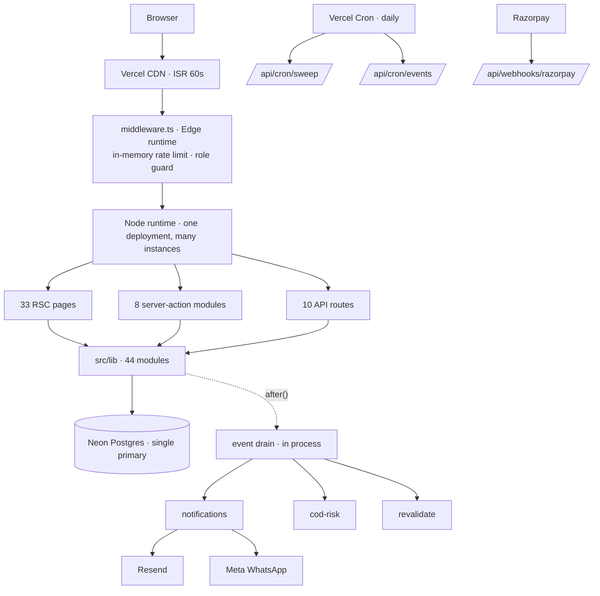

# Current architecture — audit

Snapshot of the repository at `ab1e1c8` (branch `feat/customer-accounts`), taken
before the reliability, cache, CMS and async work. This is the baseline the
later phases are measured against. Nothing here was changed while writing it.

Everything below was read from the code. Where this document says a thing does
not exist, there is no code for it.

---

## What exists



| Area | State | Where |
|---|---|---|
| Checkout, order + lines, stock reservation in one transaction | Implemented | `lib/orders.ts`, `lib/inventory.ts` |
| Checkout idempotency (unique index on `orders.idempotency_key`) | Implemented | `lib/orders.ts` |
| Transactional outbox (`domain_events` written inside the order tx) | Implemented | `lib/events.ts` |
| Per-(event, consumer) delivery records, retry up to 5 | Implemented | `event_deliveries` |
| COD risk gate with owner resolution | Implemented | `lib/cod-risk.ts`, admin order page |
| Stock restoration claimed once (`stock_restored_at`) | Implemented | `restoreOrderStock` |
| Abandoned-reservation sweep | Implemented | `lib/reservation-sweep.ts` |
| Storefront cache invalidation on stock change | Implemented | `lib/storefront-cache.ts` |
| Owner / manager roles, three session systems | Implemented | `lib/staff-auth.ts`, `auth.ts`, `lib/customer-session.ts` |
| Razorpay order creation, signature checks, webhook | Implemented, not configured | `lib/razorpay.ts`, `api/webhooks/razorpay` |
| Environmental guidance, ingredient interactions | Implemented | `lib/environment.ts`, `lib/interactions.ts` |
| Server cart mirror | Implemented | `api/cart`, `lib/cart-server.ts` |
| Structured error reporting with redaction | Implemented | `lib/observability.ts` |

## Partially implemented

| Area | What exists | What is missing |
|---|---|---|
| Idempotency | One use: checkout, via a column on `orders` | No general mechanism; payment creation, cancellation and webhooks each improvise |
| Correlation | `correlationId` passed by hand to `reportError` | No request ID generated, propagated, or stored with events |
| Event consumers | Retry with an attempt counter | No backoff, no dead-letter state, no way to see or replay a stuck delivery |
| Payment lifecycle | `payment_status` column | No state machine; transitions are unguarded (see risks) |
| Audit | `activity_events` records some admin actions | Mixed with analytics; no old/new values, no actor for every sensitive change |
| Search | Header form routes to `/collections?q=` | Filtering happens client-side over the bundled catalogue; no search service |
| Wishlist | Browser `localStorage` only | Not persisted server-side at all — lost on a new device or cleared storage |
| Promotions | `product_pricing.sale_price` + offer window | Not recorded on the order; nothing explains a past discount |

## Missing

- Shared cache (L2). Every read goes to Postgres or to the 60-second page cache.
- Read replica routing. One connection pool, one primary.
- Queue with visibility timeout and dead-letter for work that is not an event.
- CMS. Product descriptions, benefits and ingredient copy live in `src/data/mock-data.ts`.
- Object storage. No upload path of any kind.
- Optimistic concurrency. Two owners editing a price: last write wins silently.
- Asynchronous AI/CV jobs.
- Payment reconciliation against the provider.
- Written backup and restore procedure.

## Dependencies

Runtime: Next.js 15.5, React 19, Auth.js v5 with the Drizzle adapter,
Drizzle ORM over `postgres` (postgres-js, TCP), Zod, Sentry, Radix UI.
External: Neon, Google OAuth, Resend, Open-Meteo, Razorpay (unconfigured),
Meta WhatsApp Cloud API (unconfigured), MSG91 (optional).

## Data flow — checkout

```text
placeOrder / POST /api/payments/razorpay/create
  └─ createOrder
       ├─ idempotency pre-read
       ├─ BEGIN
       │   ├─ reserve stock   UPDATE inventory … WHERE quantity >= n
       │   ├─ insert address, order, order_items
       │   └─ insert domain_events (order.placed, inventory.stock_out)
       ├─ COMMIT (unique violation on idempotency_key → return winner)
       └─ after(): drain notifications, cod-risk, revalidate
```

## Module-level state

Checked for the pattern the brief warns about (`let CACHED_X = null`).
None exists. The only module-level mutable values are the toast queue (UI),
a memoised dummy password hash (constant after first use), and the two
rate-limit maps (documented as advisory). No correctness depends on process
memory.

---

## Risky areas — ranked

### 1. A late `payment.failed` can un-pay a paid order — correctness, money

`markOrderPaymentFailed` has no state guard. Razorpay sends one webhook per
payment *attempt*, not per order, and does not guarantee order. A customer
whose first UPI attempt fails and whose second succeeds can produce
`captured` then `failed`. The failed handler then releases the stock of a paid
order and sets `payment_status = 'failed'`. The goods are oversold and the
order looks unpaid.

The reverse ordering is also wrong: `failed` (attempt 1) releases stock, then
`captured` (attempt 2) marks the order paid without re-reserving it.

### 2. An invalid signature on `/verify` marks the order failed

`POST /api/payments/razorpay/verify` calls `markOrderPaymentFailed` when the
signature does not verify. A bad signature proves nothing about the payment —
it proves the request is not trustworthy. Combined with risk 1, a request with
a real Razorpay order id and a garbage signature can flip a paid order to
failed and release its stock.

### 3. The sweep cancels orders that may have been paid

The abandonment sweep cancels unpaid Razorpay orders after 30 minutes without
asking Razorpay. Razorpay retries webhooks for up to 24 hours. A payment whose
webhook was delayed is cancelled, its stock released, and then marked paid
when the webhook finally lands. A timeout is being treated as a failure.

### 4. Webhook events are not deduplicated

Idempotency depends on the handler's read-then-write check. There is no
record of which provider events were processed, so there is nothing to
answer "did we handle this?" or to replay from.

### 5. Wishlist is not durable

Lives only in the browser. Not a correctness risk for commerce, but it
contradicts the rule that durable user state lives in Postgres.

### 6. Price edits can silently overwrite each other

`setPricing` is an unconditional upsert. The last save wins without either
operator being told.

### 7. The Neon free plan keeps 6 hours of history

`history_retention_seconds = 21600` on the project. Point-in-time recovery
cannot reach further back than six hours. A bad migration discovered the next
morning is not recoverable from PITR on this plan.
