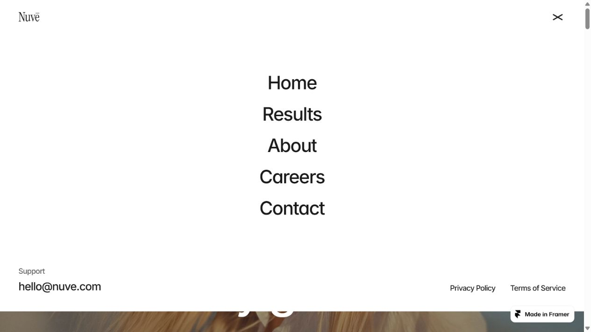
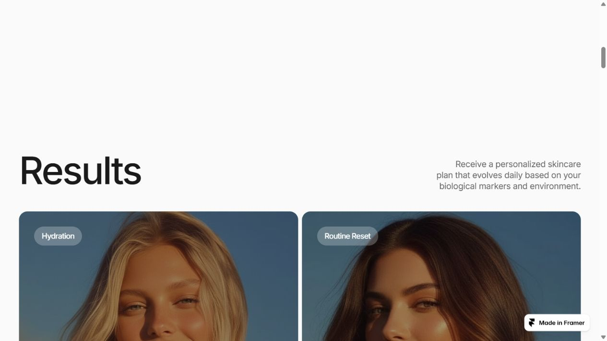
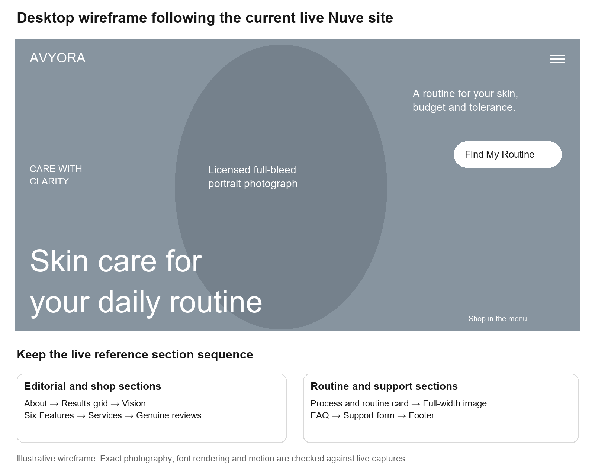
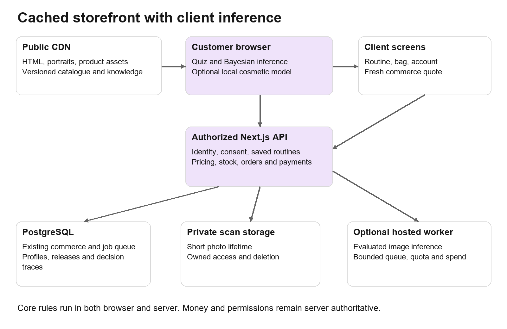
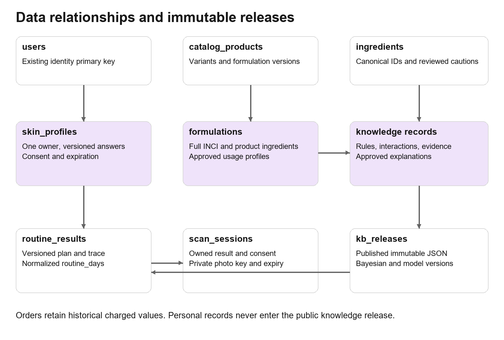
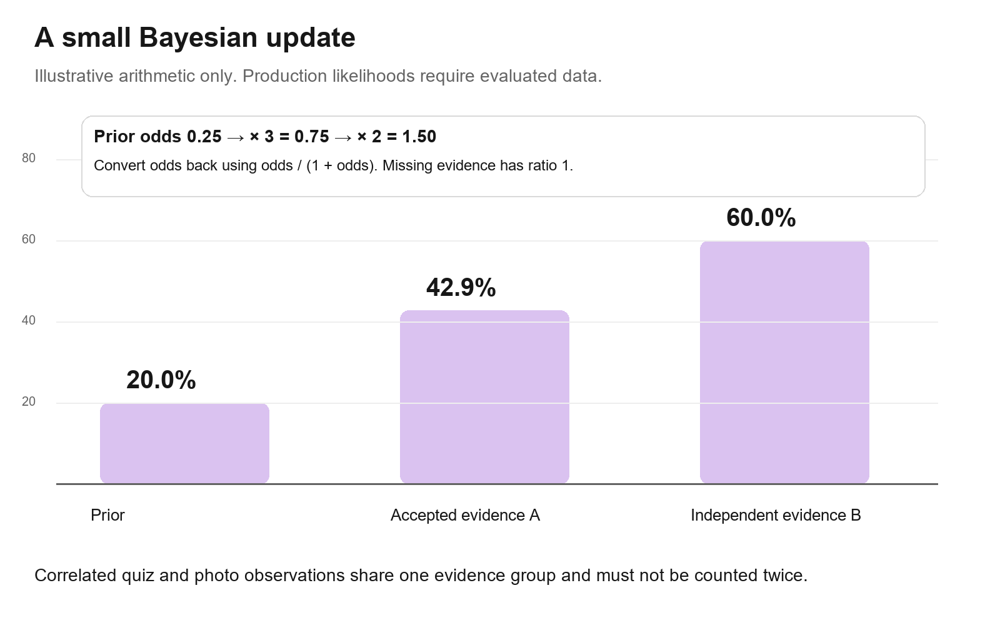
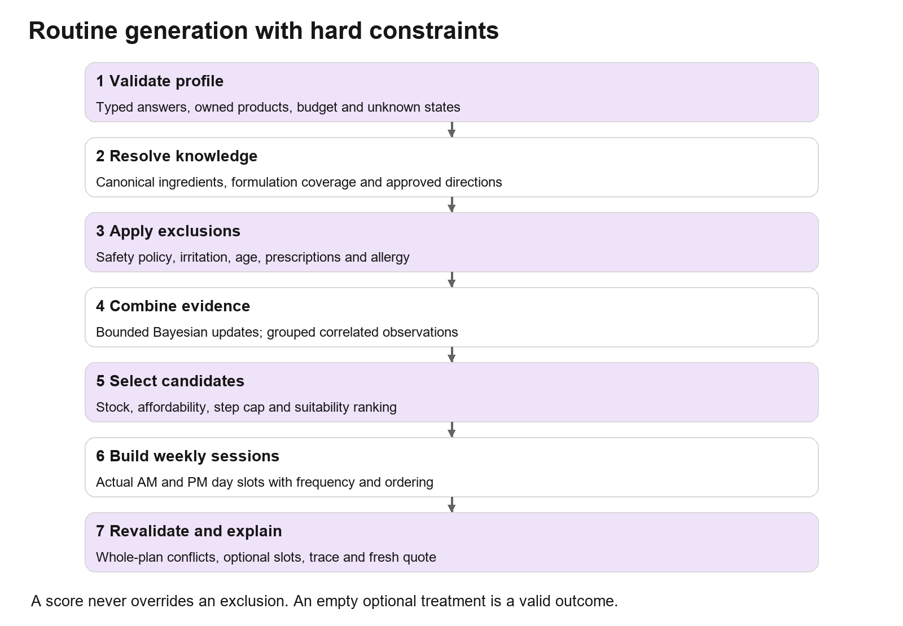
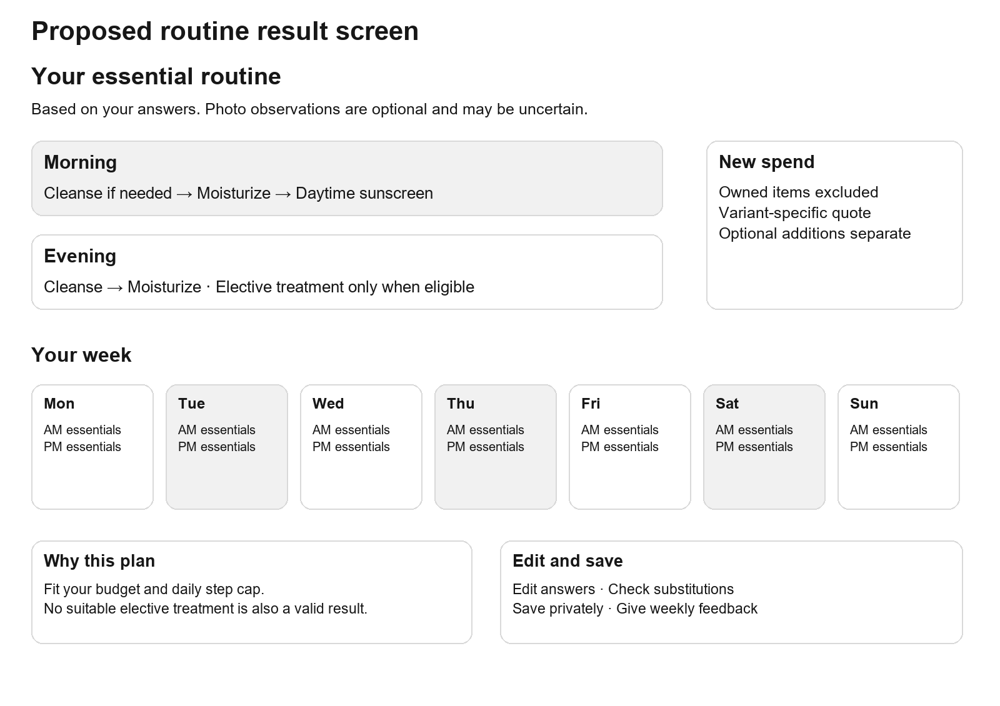
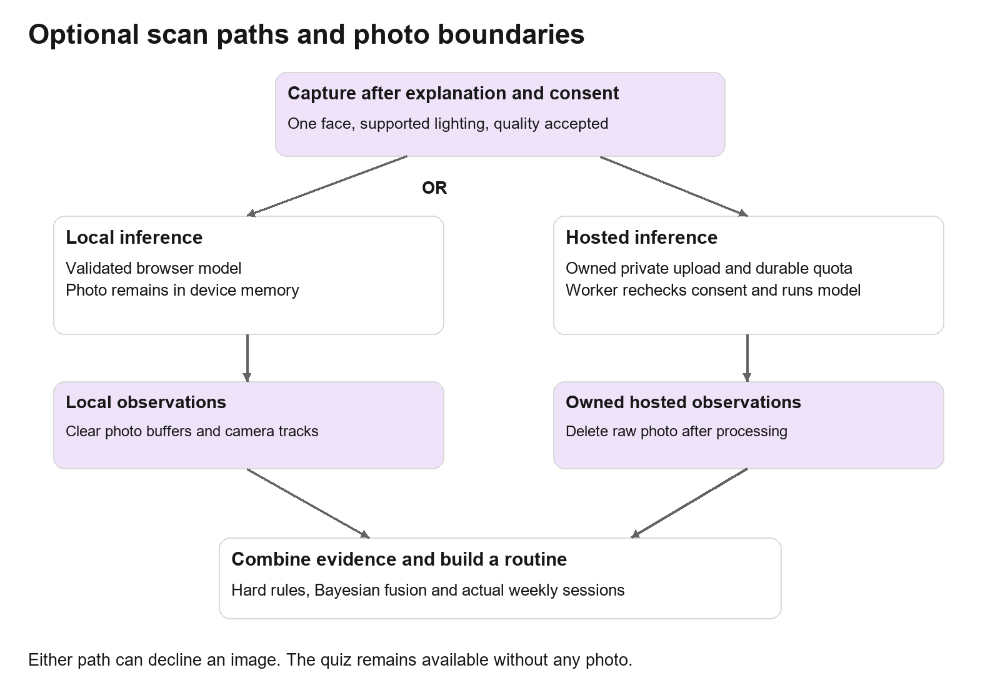

# Avyora Developer Implementation Specification

7 October 2026 • Desktop website architecture, data, recommendations, face scanning and redesign

We will retain the existing commerce backend, replace the routine finder with a versioned knowledge base and a small Bayesian evidence model, and redesign the desktop storefront around the current live Nuvē website at https://nuve-beauty.framer.website/. Lovi and its linked Figma Community resource provide secondary inspiration for explaining scans, ingredients and routines. The public storefront will use cached HTML and assets. Quiz interaction, routine calculation and optional supported-device image analysis will run in the browser. The backend will continue to own identity, money, inventory, permissions and saved records.

The immediate priority is correctness. A visually convincing scanner cannot compensate for incorrect prices, unsupported claims or an irritated-skin recommendation that still contains exfoliation. Implement the audit fixes before expanding personalization. The target is an affordable routine that the customer can understand and follow, with optional additions and honest uncertainty.

This document is the implementation contract for the developer. Numeric quotas, performance budgets, design tokens and rollout thresholds are proposed starting settings, not measured production capacity or established clinical accuracy. Product directions and formulation rules require qualified review before publication. The prior audit remains the evidence register for reproduced defects.

Current delivery scope is the desktop website. Complete and test its redesign, commerce, recommendations and optional scanning before starting mobile UI design or setup. Mobile and tablet layouts, narrow-screen navigation, touch-specific interactions and device-specific scan validation are deferred until the owner finishes reviewing the desktop site. Keep the shared data contracts and domain services reusable for that later phase.

## 1 Scope and delivery decisions

| Area | Decision | Reason |
| --- | --- | --- |
| Application | Keep Next.js 15, TypeScript, React, Tailwind, Radix, Drizzle and PostgreSQL | Existing payments, inventory, orders, CMS and operations already have useful boundaries |
| Backend | Modular monolith plus an independently runnable image worker when needed | Avoid operational complexity while keeping expensive tasks outside checkout |
| Routine intelligence | Pure TypeScript rules plus a calibrated Bayesian evidence model | Small catalogue and bounded questions do not justify a generative model per recommendation |
| Knowledge base | PostgreSQL authoring data compiled to a small versioned JSON release | Browser inference can be cheap, repeatable and explainable |
| Face capture | Optional; quiz always works without a photo | A failed scan must not block shopping or a routine |
| Image inference | Evaluate a small licensed cosmetic model; browser ONNX where validated, hosted CPU fallback where justified | Landmarks alone do not measure acne, hydration or ingredient suitability |
| Assistant | Structured questions, searchable approved answers and template explanations first | No LLM required for routine generation or routine explanations |
| Rendering | Static or explicitly cached public pages with client interaction; dynamic private commerce | Client components are not a guarantee of lower server usage |
| Redesign | Match the visible reference composition and motion, then extend its visual language to every current route | Preserve feature access and commerce conversion |
| Production | Feature flags, additive migrations and rollbackable releases | Changes must not interrupt paid orders or fulfillment |
| Platform scope | Desktop website first; mobile UI and setup after owner desktop testing | Establish correct desktop behavior before adapting the interface |

Existing source baseline is repository HEAD 6114543. The audit found 27 compiled catalogue products. Formulation highlights are not a complete ingredient database. Do not label a recommendation safe merely because a string failed to match an ingredient.

## 2 Live references and fidelity contract

The owner selected the current live Nuvē website as the desktop replica target. It supersedes the earlier lavender video for layout, typography and section order. The live site is publicly accessible; its product claims and example business content are reference copy, not evidence of Avyora capabilities. Firecrawl retrieved Nuvē, Lovi and the Figma listing on 7 October 2026. Browser inspection verified Nuvē's hero, menu and results grid. Firecrawl's interaction run timed out; page retrieval succeeded.

| Reference | URL | Authority in this project |
| --- | --- | --- |
| Nuvē live desktop | https://nuve-beauty.framer.website/ | Main visual authority for layout, image proportions, typography, menu and section rhythm |
| Lovi live site | https://lovi.care/ | Secondary inspiration for explaining the scanner, ingredient fit and routine progress |
| Lovi Community file | https://www.figma.com/community/file/1392577734404895491/lovi-landing-page-ui-web-to-figma | Secondary design resource; the public listing and preview were inspected, not editable layer measurements |
| Earlier supplied video | c3cde6a7c5d9a9ce274c76829961baf8.mp4 | Archived earlier direction; do not combine its lavender hero with the selected live design |


The live hero fills the viewport with a portrait photograph and white text. Its wordmark sits at the upper left and the menu trigger at the upper right. Supporting copy and a white pill CTA occupy the upper right; a small uppercase statement sits on the left; the large two-line headline sits near the bottom left. The page then uses off-white editorial sections, large headings, image grids, feature rows, a process and pricing block, FAQ, consultation form and footer. The page uses Inter for the hero and section headings and Instrument Serif for the wordmark. This differs from the earlier video's rounded white panel and scan rectangles.

The visible live menu expands into a nearly full-height white overlay with large centered links, an upper-right close control, support details at the bottom left and legal links at the bottom right. Preserve this desktop behavior and geometry while routing Avyora links to its real features. Do not introduce a row of top navigation links from the old design into the reference hero.



For fidelity, first implement a desktop comparison fixture that reproduces the reference geometry, crop, fonts and states. Then substitute Avyora identity, approved copy, catalogue data and working routes through component props. Record every intentional production difference. A changed image, headline or business action cannot be called identical pixels; the required one-to-one match concerns the reference structure, visual proportions and motion, with the explicit commerce adaptations in section 3.

Use original template assets where their use is permitted, or record replacements by asset slot, crop and aspect ratio. A screenshot demonstrates layout; it is not an editable source asset. The Community listing identifies Web to Figma and labels that resource CC BY 4.0; inspect its attribution and asset coverage before reusing its contents. Do not treat the community listing ID as an editable Figma node ID. No design file was duplicated or edited during this inspection.

## 3 Desktop section mapping and visual system

Follow the current live Nuvē section sequence, then express Avyora functionality inside those layouts. Keep the full-screen hero, editorial spacing, large cards and menu overlay. Avoid mixing Lovi's blue and pink theme or the earlier video's lavender panel into this primary design.

| Order | Live reference section | Avyora adaptation within the same visual structure |
| --- | --- | --- |
| 1 | Hero | Full-width portrait, upper-right routine CTA, large lower-left headline; Avyora wordmark and menu; direct Shop access remains available |
| 2 | About Us | Image and large explanatory text; explain skin, budget and tolerance; replace the 98 percent reference metric with a verified fact or nonnumeric explanation |
| 3 | Results | Preserve the two-column oversized image-card grid; show shop by concern, best sellers and new launches with current prices, SKU choices and stock |
| 4 | Vision | Preserve the full-width portrait and editorial statement; describe the brand's approach without fabricated expert endorsements |
| 5 | Features | Six numbered rows for quiz, optional photo, weekly routine, ingredient guidance, budget and owned-product support, and follow-up |
| 6 | Services | Preserve the large heading, feature descriptions and image pairing; link to the routine finder, catalogue, ingredient knowledge and journal |
| 7 | Testimonials and Smart Skincare | Preserve the image and quote composition; use genuine customer evidence or clearly identified product education until reviews exist |
| 8 | Pricing and process | Keep the Scan, Understand and Adapt explanation and large offer card; show a routine preview or real bundle quote rather than inventing a 29-dollar monthly subscription |
| 9 | Full-width image | Preserve the image break and focal crop; use approved Avyora campaign photography |
| 10 | FAQ | Preserve the heading, supporting copy and expandable questions; cover routines, scan limits, shipping, returns and data saving |
| 11 | Consultation form | Preserve the form composition; route to actual support or a consent-aware callback request, with truthful response expectations |
| 12 | Footer | Preserve column hierarchy; add Track Order, account, wishlist, policies, journal and a working newsletter |



The following measurements come from browser inspection at a 1280 by 720 CSS-pixel viewport, with 1265px content width because of the vertical scrollbar. They are measured reference values, not universal settings for every desktop width. Automated branding extraction returned default blue link values for some anchors; use visible child text styles and computed element styles instead of copying those defaults.

| Element | Measured value | Implementation instruction |
| --- | --- | --- |
| Main page background | rgb 250 250 250, equivalent to #FAFAFA | Use off-white editorial surfaces and full-bleed image sections |
| Hero | 1265px wide, 720px high, square outer corners | Height follows the desktop viewport; do not wrap it in a rounded lavender panel |
| Desktop content gutter | 40px on the left in hero and results | Match 40px at the measured width; capture and calibrate wider viewport variants |
| Hero heading | Inter, 100px, weight 500, line-height 100px, tracking -6px, white; width 900px | Match line breaks and baseline at the measured viewport; avoid shrinking to the old 56px hero |
| Section heading | Inter, 80px, weight 500, line-height 88px, tracking -3.2px, #1A1A1A | Use the measured type scale for the primary sections |
| Wordmark | Instrument Serif, 28px, weight 400, line-height 33.6px, tracking -0.8px | Keep the wordmark position and typographic weight when adapting the brand |
| Hero supporting copy | Inter, 20px, weight 500, line-height 26px, tracking -0.6px | Preserve the upper-right alignment and restrained width |
| Primary hero CTA | Approximately 155 by 49px; white fill; radius 100px | Use a pill shape; allow width to fit approved action text |
| CTA text | Inter, 16px, weight 500, line-height 20.8px, tracking -0.64px, #1A1A1A | Use the child text style, not the anchor's default blue color |
| Results image cards | Approximately 588 by 585px, radius 18px, two columns | Preserve near-square imagery; place commerce actions in the card's defined content area |



Use #FAFAFA for primary page surfaces, #1A1A1A for dark text and buttons, #FFFFFF for photo-overlay text and light buttons, and #696666 for muted text after contrast checking. The primary headings are sans serif; the serif font is used for the wordmark, not as a blanket replacement for Inter headings. Self-host approved font files and record exact weights. Card radius is 18px in the measured grid; hero sections have square outer edges. Use spacing increments of 4, 8, 16, 24, 40, 64 and 100px as implementation tokens, then calibrate against captures rather than treating proposed tokens as measured values.

Desktop acceptance widths remain 1280, 1440 and 1920px. Preserve the full-width hero, the portrait focal point, two-column image grid and large editorial type across those widths. Capture each reference width before fixing responsive desktop values. Mobile UI, tablet stacking and touch-specific setup remain deferred until the owner finishes desktop testing.

Implement motion with transforms and opacity. Reference source inspection showed entry translations and opacity changes, a translated and scaled hero image, animated button text layers and word-by-word editorial text markup. Match the settled and intermediate states using recordings of the current site. Exact duration and easing were not measured; provisional values such as 450 to 700ms for reveals must be tuned against those recordings. Keep native scrolling unless measured behavior requires a small scroll controller. Do not import the whole Framer runtime into the commerce application just to recreate a visual effect. Under reduced motion, show final readable text and preserve every control.

Lovi supplies useful explanatory patterns: a visual scan example, routine products, ingredient fit and progress over time. Use those ideas within the Nuvē layouts on the routine-finder and ingredient pages. Its clinical-looking labels, skin-issue counts, branded Fit Score, sample products and app-download controls are not Avyora capabilities. Keep progress photos disabled until the separate consent and retention flow described later is implemented.


The Figma Community listing describes scanner, product, chat and timeline sections. Its public preview supports that feature-presentation direction. Exact frame dimensions, component variants and editable layers still require access to an actual design file; do not claim those were extracted from the listing. Preserve attribution if the resource is reused and keep Lovi secondary to the selected Nuvē visual system.

## 4 Component and interaction handoff

| Component | Required states | Behavior |
| --- | --- | --- |
| Header | Reference desktop menu closed/open, scrolled, authenticated, anonymous | Preserve wordmark and menu positions; expose Shop, Routine Finder, account, wishlist and bag in the overlay and approved compact controls; trap focus and return it on close |
| Hero | Full-viewport photo, entry motion, reduced motion, image failure | Preserve large lower-left headline and upper-right CTA; text and actions render even if imagery fails |
| Product card | Available, sale, unavailable, wishlisted, adding, error | One selected SKU determines shown price and add command; no default silent substitute |
| Product page | Variant selected, quantity, out of stock, stale quote | Mandatory approved directions; variant-specific price; real quantity passed to cart |
| Bag | Empty, populated, price changed, stock reduced, sync error | Show changed prices before checkout; explain adjusted quantities; do not discard cart silently |
| Quiz | First visit, resumed, invalid answer, no consent, result, no match | Back and edit retain state; no forced scan; progress text reflects actual questions |
| Scan | Intro, consent, camera denied, upload, quality check, analyzing, uncertain, failed, result | Clear retry or quiz path; stop camera tracks on leave; remove object URLs |
| Routine | Essential, optional, owned, unavailable, saved, stale | AM and PM by actual day; explanation and exclusion reasons; total new spend |
| Checkout | Loading quote, ready, submitting, retryable error, payment pending, success | Disable duplicate submissions while retaining idempotency; never trust client totals |
| Forms | Idle, validation, sending, success, failed | Newsletter, sign-in and support controls must have a real handler and readable feedback |

Use a visible focus outline, labelled icon buttons, semantic heading order, accessible dialogs and error messages linked to fields. Test keyboard-only use and 200 percent zoom on supported desktop browsers. Zoom must keep essential content and controls reachable; it is not a mobile UI milestone. Normal text must meet 4.5 to 1 contrast; large text 3 to 1. White text over photography needs a verified overlay or another readable treatment. Use a semantic menu button. Hide decorative motion from screen readers.

A screenshot comparison against the current live site is required for the hero, open menu, About section, Results grid, Features, process card and FAQ. Capture matching desktop widths, scroll positions and animation states. Use a target of at most 4px displacement for major alignment anchors once exact fonts and assets are selected; record approved differences for brand, copy and commerce controls. This is a proposed review tolerance, not a claim that a replica has already been built. Do not use the previous lavender video as the acceptance baseline.

## 5 Existing feature parity

Every route below must remain reachable after the redesign. Keep role-specific workspaces separate from the public landing page while sharing form, typography and status components.

| Existing area | Routes or modules | Redesign and preservation requirement |
| --- | --- | --- |
| Home discovery | / | Keep hero, featured products, category and concern discovery, bundles, education and footer access |
| Catalogue | /collections | Preserve filtering, sorting, selected category and concern, product cards, price and stock states |
| Product detail | /products/[slug] | Preserve gallery, sizes, quantities, ingredients, usage, related products, wishlist and bag access |
| Routine finder | /routine-finder | Replace engine and add scan entry; keep a complete quiz-only path and direct shopping |
| Wishlist and bag | /wishlist and cart drawer | Preserve local guest behavior; correct variant pricing and synchronize ownership |
| Customer identity | /login, /signup | Preserve current supported sign-in methods, validation, recovery and checkout return URL |
| Checkout | /checkout | Preserve address, COD eligibility, Razorpay, shipping, tax, order submission and recoverable pending payments |
| Orders | /orders/[orderNumber], invoice, /track-order | Preserve permission-checked details, invoice and tracking; prevent guessable order-number access |
| Customer account | /account, /account/orders, /account/addresses, /account/data | Preserve orders, address CRUD and data controls; add saved routines, scan consent and deletion status |
| Editorial and policies | /journal, /journal/[slug], privacy, terms, contact, shipping-policy, refund-policy | Preserve real content and SEO; replace placeholders with approved details |
| Owner dashboard | /admin and /admin-login | Preserve staff sign-in, revenue, status and operational summaries |
| Owner operations | /admin/orders, /admin/orders/[orderNumber], inventory, pricing, analytics, requests | Preserve existing permissions, transactional stock and price edits, reports and requests |
| CMS and media | /admin/content, /admin/content/[type]/[slug], /admin/content/media | Preserve versions, publish and media management; add catalogue and knowledge release validation |
| Reliability controls | /admin/system | Preserve event delivery, job status, retry and dead-letter visibility; add scan failures and release rollback |
| Manager workspace | /manager, /manager/stock, /manager/requests | Preserve packing, dispatch, stock and restock tasks with manager permissions |
| Backend integrations | Razorpay, notifications, environment guidance, domain events, jobs | Preserve reconciliation, idempotency, reservations, outbox retry and configured email or WhatsApp behavior |

Advertised loyalty, cashback, Buy 2 Get 3rd Free, gifts and bundle discounts are incomplete promises in the audited source. Preserve them as implementation requirements, not assumed working capabilities. Until their ledgers and order calculations exist, remove their promotional claims. Reviews have database support and display surfaces; verify submission, verification and moderation before advertising an open review program. Preserve environmental guidance as an optional explanation, without inferring a medical skin condition from weather.

## 6 Target architecture



The browser receives a public catalogue release, approved rules and model parameters. A pure inference package creates a provisional routine without a backend round trip. A saved routine is recomputed by the backend from validated inputs and the same knowledge release. The backend resolves current SKU prices and availability before showing a purchase quote and again when placing an order.

| Boundary | Responsibility | Allowed dependencies |
| --- | --- | --- |
| catalog | Products, variants, formulations, publication, public release | PostgreSQL, CMS adapters, immutable asset storage |
| personalization core | Evidence fusion, constraints, candidate scoring, schedule, explanations | Typed inputs and approved knowledge only; no network or database imports |
| routine service | Ownership, consent, saves, retrieval, feedback, server recomputation | Personalization core, catalogue, PostgreSQL |
| commerce | Pricing, promotions, cart, inventory, orders, payment state | Existing repositories, transactions, idempotency, outbox |
| scan service | Capture sessions, upload authorization, result provenance, deletion | Private storage, quality checks, optional image worker |
| operations | Admin and manager commands, audit, CMS and knowledge publish | Shared domains with role authorization |
| integrations | Razorpay, email, WhatsApp, environment cache | Adapter interfaces and background delivery |

Do not add vector search, Kafka, Kubernetes or separate microservices for each domain. Move image inference to an independent worker only when a hosted model is needed. Use the existing PostgreSQL job queue initially, with short periodic or continuous claims for interactive scans. The current daily maintenance cron is not an interactive scan worker. Monitor queue age, leases, retry count and dead letters.

Suggested new paths are src/modules/personalization/core, knowledge, contracts and service; src/modules/scan; src/workers/skin-analysis; src/components/routine; and src/components/scan. Keep src/modules/catalog, existing payment/order infrastructure and the event outbox. Browser imports must terminate at core/contracts and public knowledge, not at server repositories.

## 7 Rendering and lower cost loading

Client-side loading shifts calculation to the customer's device, but still transfers JavaScript, images and sometimes API requests. A cached static page can already avoid per-visitor rendering. Use client computation where it helps, while serving essential public content as cached HTML for fast first paint and product discovery. Next.js client components may still be prerendered; adding use client to a page does not establish a cost saving. [S1] [S2]

| Surface | Delivery | Cache and freshness proposal |
| --- | --- | --- |
| Home, policy, ingredients, journal | Static or explicit Next.js 15 cached rendering | Revalidate public copy on publish; target fallback TTL 1 hour for content |
| Product pages and collections | Cached product copy, images and metadata; client price/stock refresh | Copy release on publish; public availability snapshot 30 to 60 seconds; checkout authoritative |
| Quiz and provisional routine | Static shell plus client core; Web Worker if computation affects interaction | Immutable knowledge JSON by release hash; no personal answers in shared cache |
| Scan | Load capture and model code only when user starts | Model and WASM files cache by hash; photo and private result never CDN cached |
| Account, saved routine, checkout, admin, manager | Client loading over authenticated APIs or private server rendering as useful | Cache-Control private, no-store for sensitive responses |
| Images and fonts | Pre-generated AVIF or WebP sizes; immutable fingerprinted assets | One-year browser cache for immutable assets; approved image domain in CSP and Next config |

In Next.js 15, explicitly select caching for eligible fetches and route output; do not assume framework defaults cache every request. Audit middleware and layouts for session reads or database queries that force otherwise-public pages dynamic. Keep request authentication at private APIs. Do not configure a global static export for this existing app: it contains server actions, payments, webhooks and staff routes.

Client loading can use the existing fetch infrastructure with request deduplication and cancellation; a query library is optional. Batch prices and stock for at most 50 SKU IDs rather than one request per card. Public snapshots include quoteVersion and validUntil. On stale or failed refresh, preserve navigation and copy but mark prices unconfirmed and refresh before purchase. Server checkout can reject changed prices with a revised quote; the customer must see the change before confirming.

Proposed performance budgets are LCP at or below 2.5 seconds, INP at or below 200ms and CLS at or below 0.1 at the 75th percentile of real visits. Keep initial home JavaScript at or below 180KB compressed, hero image at or below 250KB for its selected size and the knowledge release at or below 200KB compressed. Load no vision model on the landing page. These are targets to test, not measured current values.

## 8 Cost model and operational budgets

Measure total cost rather than assuming CSR is free. Monthly variable cost is public asset transfer plus uncached API execution, database compute and storage, image inference, object operations, notifications and optional model calls. Cached public page hits should not trigger database work. Video-like motion should use a static portrait and lightweight overlays; a large autoplay hero video would increase transfer and page load.

For an illustrative 100000 visits, 1MB of public transfer per visit is roughly 100GB before caching and repeat-visit effects. A 10MB model downloaded by 1000 first-time scan users is roughly 10GB; loading it for every visitor would be roughly 1000GB. These are volume examples, not price quotes or forecasts. Plug actual provider rates, included allowances and observed cache hit rates into the calculation. [S2]

| Meter | Launch operating proposal | Action when exceeded |
| --- | --- | --- |
| Hosted scans | 100 new billable analyses per UTC day globally | Stop hosted admissions and offer quiz or validated local scan |
| Hosted worker | 2 concurrent analyses; 15-second model timeout | Queue bounded requests; cancel or retry as specified below |
| Optional LLM | Disabled at launch; no call from routine engine | Enable only with a separate approved budget and product need |
| Database queries | Public page cache hit performs zero personal DB reads | Investigate dynamic middleware, per-card API calls and repeated session checks |
| Storage | Automatic short photo lifetime; no indefinite raw uploads | Delete expired objects and alert on deletion backlog |
| Provider spending | Alert at 50, 80 and 100 percent of a configured monthly budget | At cap, disable optional hosted inference; commerce remains available |

Use separate ledger counters for admitted scans and provider attempts. Reserve one global budget slot atomically before dispatch, charge actual billable attempts and release unused reservations. Retries also consume provider budget when billed. Do not allow an optional AI spend cap to disable payment confirmation or order reconciliation.

## 9 Data types and structures

Use TypeScript discriminated unions at boundaries, Zod schemas for request validation and PostgreSQL constraints for persistent invariants. Reject unknown fields on write contracts. Version every saved input and result. Keep money in integer paise, time in UTC ISO strings at the API and timestamptz in PostgreSQL, and ingredient concentration in numeric values with explicit units and known status.

| Concept | Application type | Database or artifact type | Constraint |
| --- | --- | --- | --- |
| Existing user ID | string branded UserId | Existing users.id text | Do not rewrite authentication primary keys |
| New entities | string UUID | uuid, or text where existing foreign key compatibility requires | Stable immutable IDs; display names never keys |
| SKU and size | string branded SkuId | text UNIQUE; product FK and size label | Price and stock refer to SKU, never product plus free-text guessed size |
| Money | number branded MoneyPaise | integer CHECK value >= 0 | Safe integer at API; no floating rupee arithmetic |
| Probability | finite number in [0,1] | double precision CHECK within bounds | Reject NaN, infinity and strings |
| Quantity | integer 1 through 10 per SKU | integer with CHECK | Recheck stock and purchase cap server-side |
| Age eligibility | under18, adult, unknown | text CHECK enum | Birth date is unnecessary for cosmetic guidance |
| Pregnancy and nursing | yes, no, unknown | text CHECK enum | Never coerce prefer not to say to no |
| Safety answer | yes, no, unknown | text CHECK or validated JSON | Unknown may block treatment eligibility |
| Day and session | day 0 through 6; AM or PM | smallint CHECK and text enum | Actual day assignments support conflict validation |
| JSON profile or output | versioned object, strict schema | jsonb | Explicit byte, array and field caps; JSON does not remove validation |
| Timestamp | ISO8601 string | timestamptz | Store expires_at for records with a retention policy |
| Direction and evidence copy | bounded plain string | text | Render as escaped text; no raw user HTML |

Use Map<SkuId, Variant> and Map<IngredientId, Ingredient> in the in-memory core. Build category and concern indexes as Map<ConcernId, Set<ProductId>>. Represent exclusions as Set<ProductId or IngredientId>. Pair rules form a small adjacency map keyed by a canonical sorted pair; canonicalization avoids A/B versus B/A duplicate rules. A routine is a seven-day array of AM and PM slot arrays, not a single prose list. A purchase list is a deduplicated SKU-to-quantity map. Do not enumerate every possible combination of answers or a 2 to the power N full concern table.

## 10 Catalogue and formulation database

Reuse users, cart, order, inventory, price, ingredient, interaction, CMS, job and audit tables. Add normalized product and variant records and connect them to existing price and inventory keys through an explicit compatibility mapping. Do not migrate historical order item labels or historical charged prices into live catalogue references that can change.

| Table | Fields and PostgreSQL types | Keys and indexes |
| --- | --- | --- |
| catalog_products | id text; slug text; name text; category text; copy jsonb; published boolean; formulation_version integer; created_at and updated_at timestamptz | PK id; UNIQUE slug; index category plus published |
| catalog_variants | id text; product_id text FK; legacy_stock_key text; size_label text; volume_ml numeric(8,2) nullable; active boolean | PK id; UNIQUE legacy_stock_key; UNIQUE product_id plus size_label |
| formulations | id uuid; product_id text FK; version integer; full_inci text; coverage text known/partial/unknown; directions text; source_id uuid FK; reviewed_at timestamptz | UNIQUE product_id plus version; publication requires approved directions and coverage policy |
| product_ingredients | formulation_id uuid FK; ingredient_id text FK; position smallint; concentration numeric(7,4) nullable; unit text; concentration_known boolean | Composite PK formulation_id plus ingredient_id; index ingredient_id; CHECK known implies a valid unit and value |
| product_targets | product_id text FK; concern_id text FK; fit_weight real; evidence_id uuid FK | Composite PK product plus concern; fit_weight constrained [0,1] |
| usage_profiles | id uuid; formulation_id uuid FK; session text; max_weekly_uses smallint; introduction jsonb; ordering_role text; reviewer_id text FK | Bounded approved schedule policy; index formulation_id |
| evidence_sources | id uuid; title text; url text nullable; source_type text; retrieved_at timestamptz; excerpt text; limitations text | PK id; references from rules, product claims and public explanations |

Extend the existing ingredients table rather than creating a second dictionary. Normalize synonyms once during import into an alias-to-ID map; ambiguous labels remain unresolved. Full INCI position records are independent of the abbreviated ingredient highlights shown on cards. Retinaldehyde and retinol have distinct IDs and directions. SPF is a product claim with supporting finished-product documentation, not an ingredient guessed from the label.

Publication checks must reject duplicate SKUs, invalid concentration units, impossible prices, missing directions for active products, broken evidence links and unresolved safety coverage for restricted treatment use. Support an honest unavailable or unqualified treatment slot. Never silently substitute a product simply to fill a card.

## 11 Profiles routines scans and consent database



| Table or extension | Fields and types | Ownership and indexes |
| --- | --- | --- |
| skin_profiles | id uuid; user_id text nullable FK; anonymous_owner_hash text nullable; schema_version integer; answers jsonb; created_at, updated_at, expires_at timestamptz | CHECK exactly one owner; index user_id plus updated_at; index expires_at |
| routine_results extension | Existing id text; owner as above; profile_id uuid FK nullable; schema_version integer; input_hash text; kb_release text; engine_version text; model_version text nullable; result jsonb; expires_at timestamptz | Preserve current IDs; owner-scoped list index; input hash and release for dedupe; expiry index |
| routine_days | routine_id text FK; day smallint; session text; position smallint; product_id text nullable; owned_item_id text nullable; variant_id text nullable; usage_profile_id uuid nullable | PK routine plus day plus session plus position; CHECK valid day/session; one referenced product or owned item |
| routine_feedback | id uuid; routine_id text FK; user_id text FK; week smallint; adherence text; tolerability text; reported_change text; created_at timestamptz | UNIQUE routine plus user plus week; bounded enums; no automatic clinical training label |
| scan_sessions | id uuid; user_id text FK; consent_id uuid FK; status text; mode text local/hosted; model_version text; quality jsonb; result jsonb nullable; object_key text nullable; created_at, expires_at timestamptz | Owner plus created_at index; expiry index; status plus created_at for operations |
| consent_records | id uuid; user_id text nullable; anonymous_owner_hash text nullable; purpose text; policy_version text; granted_at timestamptz; withdrawn_at timestamptz nullable | CHECK one owner; index owner plus purpose; withdrawal immediately prevents new work |
| kb_releases | id text hash PK; schema_version integer; artifact_key text; status text draft/approved/published/revoked; reviewer_id text; published_at timestamptz; checksum text | Immutable artifact; active pointer updated transactionally; old releases retained for traceability |
| model_releases | id text PK; task_scope jsonb; artifact_key text; license text; evaluation jsonb; calibration_key text; status text; created_at timestamptz | Separate cosmetic model version from Bayesian parameter version |

Use validated JSON for a bounded profile and routine result, then normalized schedule rows for querying, validation and reports. Persist one authoritative snapshot plus its version; do not allow normalized rows to disagree with JSON. Write both transactionally. Public catalogue data must not contain personal profiles, private answers or staff contact details.

PostgreSQL foreign keys, CHECK constraints and unique indexes enforce ownership and deduplication. Create ordinary B-tree indexes first. Do not add a broad GIN index to every JSON column; add targeted expression indexes only after a concrete query needs them. Run expiry deletion in small batches using an expires_at index. Audit records contain IDs, actor, reason and version, not raw photos or health answers.

## 12 Profile and result contracts

The questions must change a decision. Ask skin type, reactivity and user priorities, budget for new products, maximum routine steps, existing products, known allergies, irritation, age eligibility, pregnancy or nursing status, prescribed treatments, experience and adherence. Use a neutral unknown state for declined or skipped sensitive answers. Sun exposure can affect sun-protection explanation, but cannot establish a diagnosis. Retain optional eye-area, body-care and catalogue category preferences as separate modules. These use user-reported needs and approved product directions, not unsupported face-model predictions.

```typescript
type TriState = 'yes' | 'no' | 'unknown';
type ConcernId = 'blemish_appearance' | 'uneven_tone' |
  'dryness_reported' | 'shine_appearance' | 'fine_line_appearance';
type SkinProfileV2 = {
  schemaVersion: 2;
  ageBand: 'under18' | 'adult' | 'unknown';
  skinType: 'oily' | 'dry' | 'combination' | 'normal' | 'unknown';
  reactivity: 'low' | 'medium' | 'high' | 'very_high' | 'unknown';
  pregnancy: TriState; nursing: TriState;
  currentlyIrritated: TriState;
  allergyHistory: TriState; // empty ingredient list does not mean no allergies
  prescribedTreatment: TriState;
  priorities: ConcernId[]; // maximum 3, unique
  budgetPaise: number; // integer, 0 to 1000000
  maxDailySteps: 3 | 4 | 5;
  experience: 'new' | 'some' | 'experienced';
  adherence: 'low' | 'medium' | 'high';
  allergyIngredientIds: string[]; // maximum 30
  preferences: { eyeCare: boolean; bodyCare: boolean };
  ownedItems: { id: string; label: string; ingredientIds: string[];
    coverage: 'known' | 'partial' | 'unknown'; prescribed: boolean }[];
};
type ObservationV1 = {
  schemaVersion: 1; concern: ConcernId;
  state: 'low' | 'medium' | 'high' | 'unknown';
  source: 'quiz' | 'vision'; evidenceGroup: string;
  quality: 'accepted' | 'uncertain' | 'rejected';
  modelVersion?: string;
};
type RoutineResultV2 = {
  schemaVersion: 2; kbRelease: string; engineVersion: string;
  mode: 'essentials' | 'gradual' | 'guidance_only';
  beliefs: { concern: ConcernId; score: number;
    display: 'reported' | 'supported' | 'uncertain' }[];
  days: { day: number; am: RoutineSlot[]; pm: RoutineSlot[] }[];
  exclusions: { productId: string; reasonCode: string }[];
  explanations: { templateId: string; sourceIds: string[] }[];
  purchaseList: { skuId: string; quantity: number }[];
  quote?: { totalPaise: number; version: string; validUntil: string };
};
```

Define RoutineSlot as a discriminated union between a selected catalogue product and an owned item, with role, usageProfileId, position and explanation IDs. The concern list above is an initial bounded cosmetic scope, not a promise that a photo can measure every entry. Reported dryness is a question-based signal; do not infer hydration from ordinary RGB imagery. Adopt a clinician-reviewed nomenclature before shipping public labels.

Cap profile JSON at 16KB, saved result JSON at 32KB, owned items at 20 and ingredients per owned item at 50. Do not accept a client-produced result as authoritative. The save request contains inputs and release ID; the server creates the result. A client-supplied observation is not a medically verified measurement. Hosted results must be read by owned scan ID; local observations retain local provenance and cannot relax hard exclusions.

## 13 Knowledge base structure and governance

We have few catalogue items, but the safety knowledge still includes ingredients, formulation, exposure, directions, interactions and incomplete data. Keep that knowledge explicit. Store approved facts and decision policies as records rather than burying them in prompt text or ad hoc if statements.

| Record | Fields | Use |
| --- | --- | --- |
| Ingredient | id, INCI, aliases, class, prescription flag, cautions, evidence references | Resolve canonical identity and restrictions |
| Formulation | product, version, full INCI, concentration status, directions, coverage | Determine whether a product can enter a plan |
| Rule | id, version, predicates, effect, severity, rationale, source IDs, reviewer, dates | Exclude, require clarification, constrain frequency or order |
| Interaction | canonical ingredient pair, context, effect, scope, evidence | Validate whole schedules including owned products |
| Model parameter | concern, prior, evidence group, state likelihoods, counts, training and calibration versions | Combine bounded observations reproducibly |
| Explanation template | id, plain-language text, approved variables, source IDs | Explain selections without a generative call |
| Education answer | id, question aliases, approved answer, scope, sources, review date | Searchable help and guided assistant |

```json
{
  "schemaVersion": 1,
  "releaseId": "content_hash",
  "rules": [{
    "id": "irritation_mode",
    "version": 1,
    "when": {"field": "currentlyIrritated", "op": "eq", "value": "yes"},
    "effect": {"kind": "mode", "value": "essentials"},
    "additionalEffect": {"kind": "excludeClass", "value": "elective_irritating_active"},
    "reasonTemplateId": "pause_new_actives",
    "sourceIds": ["approved_rule_source"],
    "reviewStatus": "draft"
  }]
}
```

This is a schema example; a draft rule cannot enter a published artifact. Use a typed predicate AST with only enumerated operations such as eq, in, any and all. Never evaluate executable code or JavaScript strings from CMS rules. Predicates must refer to known profile fields. Contradictory or unreachable rules fail compilation. Safety effects always precede commercial ranking.

Author records in the existing CMS or a small restricted knowledge editor. A publish pipeline validates links, coverage, reviewer status, schema and golden profiles, then produces catalogue.json, rules.json, parameters.json and explanations.json under one release manifest. Hash artifacts, retain the previous release, update the active pointer atomically and invalidate public content caches. Staff can revoke a release; new saves reject a revoked release and invite recalculation. A qualified reviewer approves product directions and safety content; developers approve schema and execution changes.

Start with compact JSON, alias maps and token-based search over approved answers. A vector database, embeddings and an LLM knowledge pipeline are unnecessary for this catalogue size. Add those only if a measured retrieval problem remains after lexical search and guided questions.

## 14 Bayesian model and evidence fusion

Use a small model per cosmetic concern, not a giant model that enumerates every skin state. The initial model is a Bernoulli concern state with a few categorical observations. It produces an internal estimate that influences prioritization; it is not a diagnosis, a measured skin-health score or a proof of ingredient safety.



For concern C, convert prior probability p into odds p divided by 1 minus p. For an accepted observation e, compute its likelihood ratio L as P(e given C) divided by P(e given not C). Multiply the prior odds by the accepted likelihood ratio, then convert odds back to probability using odds divided by 1 plus odds.

An illustrative prior of 0.20 gives odds 0.25. A likelihood ratio of 3 gives odds 0.75 and posterior 0.429. An independent second observation with ratio 2 gives odds 1.50 and posterior 0.60. These values demonstrate the arithmetic; they are not trained Avyora parameters and must not appear as validated accuracy in marketing.

Quiz and photo evidence are often correlated. Asking whether blemishes are visible and then detecting the same visible blemishes is not two independent confirmations. Group those observations into a shared evidenceGroup and use a fitted joint likelihood or one representative observation. For genuinely separate groups, use conditional independence only where evaluation supports it. A weighted log-odds model with calibrated coefficients is an alternative when independence fails. Do not multiply a raw vision confidence into a Bayesian posterior or treat confidence as a likelihood ratio.

Missing, declined and rejected observations are neutral, equivalent to likelihood ratio 1. Conflicting high-quality observations lead to a clarifying question or an uncertain result. Hard safety answers never become weaker because a photograph looks reassuring. If unknown pregnancy or a prescribed treatment makes an elective active ineligible under the approved policy, no posterior score can override that block.

Fit categorical likelihoods from explicitly consented, appropriately labeled data with Laplace smoothing. Keep patient-level training and test splits; repeated photos of one person cannot leak across splits. Bayesian Beta priors may smooth prevalence or tolerability counts, but reported outcomes and purchases are not equivalent to expert cosmetic labels. Hand-set priors remain assumptions until validated. With scarce data, ship conservative rules and quiz-reported priorities while collecting permitted validation data, rather than inventing numeric certainty. Naive Bayes can classify well while yielding poorly calibrated probabilities. [S4]

Calibrate internal probabilities on held-out people and evaluate Brier score, log loss and reliability plots by supported skin-tone and device cohorts. A practical release comparison is improvement over the prior-only baseline without degrading any monitored group. Freeze a test set, document confidence intervals and abstention coverage, and evaluate drift before updating parameters. Use sigmoid calibration when data support it; isotonic requires enough independent validation data. Until calibration is credible, display uncertain or reported categories rather than precise percentages. [S5]

## 15 Bayesian inference implementation

The model artifact contains prior probabilities, state likelihoods, group definitions, validation scope and calibration parameters. Browser and server use the same pure TypeScript function. With 5 concerns and 20 accepted groups, inference takes roughly 100 likelihood lookups and additions, plus catalogue filtering and a seven-day planner. Complexity is O(concerns times groups plus products times rules plus planned slots squared). This is an operation estimate; benchmark real devices before claiming a latency.

```typescript
function inferConcern(prior: number, groups: EvidenceGroup[], kb: KB): number {
  const eps = 1e-6;
  const p = Math.max(eps, Math.min(1 - eps, prior));
  let logOdds = Math.log(p) - Math.log1p(-p);
  for (const group of groups) {
    if (group.quality !== 'accepted' || group.state === 'unknown') continue;
    const theta = kb.likelihoodFor(group); // one record per evidence group
    if (!theta || !theta.validatedFor(group.scope)) continue;
    logOdds += Math.log(Math.max(eps, theta.givenConcern))
             - Math.log(Math.max(eps, theta.givenNoConcern));
  }
  const raw = logOdds >= 0
    ? 1 / (1 + Math.exp(-logOdds))
    : Math.exp(logOdds) / (1 + Math.exp(logOdds));
  return kb.calibrate(raw); // versioned held-out calibration, if valid
}
```

The snippets in this document are interface and algorithm sketches, not paste-ready complete modules. Define EvidenceGroup and KB with strict types, reject nonfinite parameters and verify both likelihood distributions sum to one within a tolerance. Avoid treating unknown or zero-sample likelihoods as certainty. Keep a trace of accepted groups and rule IDs for explainability, without persisting raw photos unless separately authorized.

Use lightweight clinician-reviewed question selection. Ask the missing answer that can change an exclusion or step count first; only then ask a question that reduces uncertainty about a priority. Expected information gain is optional and can be computed from the small probability tables. Do not ask ten more questions that cannot change the product or schedule.

## 16 Routine selection and weekly planning



First normalize and validate the profile. Resolve ingredient identities and known coverage, apply all hard exclusions, combine accepted evidence and identify the essential routine. Then filter SKUs for availability, budget and appropriate directions, score the eligible candidates, build actual sessions for seven days, and validate the whole schedule again. Explanations are generated from approved templates and the decision trace.

Start with an approved essential core such as cleansing when needed, moisturizer and daytime sunscreen, with details suited to the actual products and user context. A beginner's daily step cap applies to each displayed session and excludes optional purchase pressure. Toner, essence, eye patches and cleansing oil are never mandatory solely because the catalogue has them. Prioritize one elective concern treatment only when the profile, formulation and approved directions permit it. AAD guidance supports a simple cleansing, moisturizing and protection approach. [S6]

| Constraint | Implementation |
| --- | --- |
| Current irritation | Approved essentials or guidance mode; remove elective irritating actives across the entire plan |
| Unknown safety answers | Ask if necessary; leave elective treatment empty when eligibility cannot be established |
| Pregnancy or nursing and under18 | Apply reviewed ingredient and product policies; image scores cannot override restrictions |
| Allergy | Exclude known matching ingredients; partial coverage cannot prove compatibility |
| Prescribed treatment | Do not replace it or invent a combined regimen; provide limited guidance and referral where appropriate |
| Budget | Total new purchases including chosen variants must fit budget; honor owned essentials first |
| Routine complexity | Enforce maxDailySteps for each AM and PM; optional upgrades are separate |
| Stock | Filter actual active SKU; alternative must pass the same constraints |
| Frequency and interaction | Product-specific weekly use cap and same-session conflict graph; instructions encoded by actual day |
| Adherence | Lower complexity and introduction pace; do not assume a complex schedule is achievable |

Use a proposed candidate score with normalized terms: 0.50 concern fit plus 0.25 tolerability fit plus 0.15 affordability plus 0.10 compatibility with owned routine. Each term lies in [0,1]; tune against expert-approved examples. Hard exclusions are not negative score penalties that another score can overpower. Margin and raw co-purchase count are excluded from this personalized score. Generic product cross-selling may use co-purchase support after shared exclusions, but must remain labelled as merchandising rather than individualized skin advice.

For 27 products, a bounded greedy planner with backtracking is sufficient. Choose essential slots, then consider a small number of eligible treatments and assigned evenings. Reject combinations that violate frequency, conflicts, sequencing or step caps; return the best valid plan or an empty optional slot. Never put a retinoid and exfoliant in the same session merely because prose says to alternate. Review formulation-specific interaction rules instead of applying blanket bans to every active class.

## 17 Routine output and follow up



Show the essential routine first, then optional additions. Each card includes role, chosen variant, actual approved directions, reason, price, stock and owned-product status. A weekly toggle must change actual day slots, not just explanatory text. The spend summary shows new products only, separates optional additions and shipping, and allows removal or substitution followed by revalidation.

| Output field | Required explanation |
| --- | --- |
| What we used | Quiz answers and accepted photo observations; show photo limitations |
| Why this product | Approved concern match, tolerance and affordability reason |
| Why a treatment is absent | Missing eligibility, irritation, stock, budget or unavailable suitable formulation |
| Schedule | Actual day, AM or PM, order and product-specific frequency |
| Uncertainty | Reported versus observed; no diagnosis or unvalidated percentage |
| Save state | Session only, saving, saved with ID, failed, stale release |
| Follow up | Optional weekly adherence and tolerability check; stop and seek qualified advice for concerning symptoms |

Save only on a clear user action after the appropriate data-saving choice. Return the routine ID and a working private read route such as /account/routines/[id]. A guest can use a server-generated random ownership secret in an HttpOnly cookie if guest saving is enabled; store only a hash. Never treat an arbitrary client anonymousId as ownership proof. On sign-in, migrate owned guest records transactionally and rotate ownership secrets. Do not put answers, scan scores or photos in share URLs.

Follow-up is a small state machine: stable, uncertain adherence, irritation reported, paused and guidance required. An irritation report switches to reviewed conservative guidance and stops elective additions. Do not automatically retrain the image classifier or declare a product effective from a purchase or positive review. Use consented follow-up for product improvement with documented labels and analysis limits.

## 18 Face scan scope and device pipeline



Offer photo analysis as additional cosmetic evidence. Ordinary camera imagery may support evaluated appearance tasks such as visible blemish-like regions, uneven tone appearance or shine appearance. It cannot reliably establish hydration, allergy, pregnancy, exact skin type, ingredient tolerance, cancer, infection or other medical diagnoses. Fine lines, redness and pores also require a specific validated task and capture protocol before becoming public promises.

Use MediaPipe Face Landmarker for finding a single face, orientation and crop regions. It supplies landmarks and related face outputs, not a validated skincare classifier. Use ONNX Runtime Web for a separate licensed cosmetic model when its accuracy and device performance have been evaluated. WebAssembly is the compatibility path; test optional WebGPU acceleration rather than assuming all devices support it. Run expensive work in a worker and load it only after scan entry. [S3] [S7]

| Stage | Implementation and bounded input |
| --- | --- |
| Explain and consent | Describe local or hosted mode, task scope, retention and optional save; quiz skip is equally visible |
| Capture | HTTPS getUserMedia with user-initiated permission; upload alternative; default one face and neutral lighting |
| Sanitize | Decode actual format, strip metadata through re-encoding, cap file at 5MB and decoded image at 12 megapixels |
| Quality | Reject multiple or no faces, unsupported pose, severe blur, occlusion and lighting outside evaluated ranges |
| Crop | Use landmark geometry to create deterministic model regions; no identity embedding |
| Infer | Validated cosmetic model returns defined scores and task-specific uncertainty |
| Map evidence | Convert calibrated model output into evaluated evidence states; unknown on unsupported conditions |
| Recommend | Bayesian fusion and hard constraints; then routine generation independent of any LLM |
| Cleanup | Stop camera, revoke object URLs, clear raw arrays; hosted deletion according to lifecycle |

Prefer local-only inference if the validated model fits supported devices. Raw photo stays in memory by default; do not store it in localStorage, analytics or a service worker cache. A local scan is not a server-trusted measurement. If a hosted mode is needed, require authenticated ownership, fresh processing consent and a bounded upload session. A model license must permit this commercial use. Do not select a pretrained diagnosis model merely because its demo looks persuasive.

## 19 Hosted scan API and job lifecycle

The current skin-analysis module is a provider interface with no configured analyzer, capture UI or persisted result. Extend it instead of pretending it is a finished scan feature. The existing storage interface exposes public URLs; create a private-photo adapter with private put, authorized signed read, delete and existence checks. Public CMS images and private customer photos require separate storage access policies.

| State | Event | Result |
| --- | --- | --- |
| created | Session authorized with consent and quota | Issue a 5-minute upload authorization for a server-generated object key |
| uploaded | File existence, owner and decoded limits verified | Queue one analysis with input hash, model version and consent ID |
| queued | Worker lease claimed | Set processing; recheck expiry and consent before inference |
| processing | Success | Store bounded observations, quality, versions and completed timestamp |
| processing | Timeout or transient failure | Retry at most once within total budget; record billable attempt |
| processing | Invalid input, unsupported model or consent withdrawn | No retry; failed, expired or revoked status |
| completed | Owned result retrieval | Return observations and limitations, not a public photo URL |
| any state | User deletion or expiry | Cancel pending work, suppress results and delete photo and derived records |

Proposed hosted timeout is 15 seconds per inference attempt, total scan deadline 60 seconds and at most 2 attempts. Queue admission is bounded at 50 pending jobs; refuse new hosted work with a readable retry or quiz alternative if the backlog is full. Use a 30-second lease with heartbeat for work requiring it; atomic result transition and dedupe prevent duplicate completion. Keep the existing queue's retry and dead-letter controls while persisting the result currently discarded by the handler.

Private upload should use a signed POST policy or proxy route that enforces content length, permitted key and expiry. Signed PUT alone cannot be assumed to enforce size constraints across providers. Confirm actual size and decode safely after upload. Do not accept arbitrary remote image URLs, public keys supplied by users or imageKey without ownership verification. Never log signed URLs or raw image bytes.

The current Permissions-Policy denies camera globally. Set camera=(self) on the scan surface and restrict unrelated capabilities. Review the actual middleware header precedence rather than adding a competing header in a different file. Update CSP worker-src, model fetch, private upload connect-src and approved image domains with narrow host allowlists. If required by the selected WASM runtime, use the narrower wasm-unsafe-eval permission on the scan policy rather than general unsafe-eval. Test the exact chosen runtime with production CSP and retain existing payment host permissions.

## 20 API contracts and authorization

Reuse existing payment and order endpoints. Names below are proposed additions or clarified contracts; implement them through route handlers or server actions with equivalent validation and permission rules.

| Endpoint | Input and result | Permission and cache |
| --- | --- | --- |
| GET /api/catalog/release | Published catalogue and knowledge manifest | Public; cache by release; no personal data |
| GET /api/catalog/availability | At most 50 SKU IDs; prices, stock status, quote version and expiry | Public, short cache; bounded query and result |
| POST /api/routines | ProfileV2, KB release, optional owned scan ID, idempotency key; returns server result and ID | Authorized owner and saving preference; no-store |
| GET /api/routines/[id] | Owned routine and stale-version state | Owner only; private no-store; 404 for unavailable or foreign IDs |
| DELETE /api/routines/[id] | Deletes owned routine and relevant personal references | Owner only; idempotent deletion |
| POST /api/routines/[id]/feedback | Bounded weekly enums and routine version | Owner only; no free-text medical history by default |
| POST /api/scans | Mode, policy version and consent; returns owned session | Authenticated hosted mode; quota before signing |
| POST /api/scans/[id]/complete-upload | Input checksum; verifies stored object and queues analysis | Owner and live consent; idempotent |
| GET /api/scans/[id] | State, observations, limits and versions | Owner only; backoff polling; private no-store |
| DELETE /api/scans/[id] | Revokes pending work and schedules deletion | Owner only; return deletion status |
| POST /api/newsletter | Email, purpose and consent version | Anti-abuse, non-enumerating response and unsubscribe path |
| POST /api/admin/knowledge/publish | Approved release ID and expected revision | Owner role, audit and publish checks |

Return a common error shape with code, message, requestId and optional fieldErrors. Use 400 for invalid shapes, 401 for absent identity, 404 for foreign private records, 409 for conflicting idempotency or stale revision, 413 for oversized payload, 422 for no valid plan or unsuitable image, 429 for quota with Retry-After, and 503 for a required unavailable dependency. A no-match routine is a useful product state; the UI should not replace it with arbitrary recommendations.

Verify same-origin and CSRF protections for cookie-authenticated mutations, even for server actions. Use existing role checks for staff commands. Check ownership for every read, write, signed read and worker task. A storage key or guessed routine ID is not permission. Save computation is replayable, but client price and client eligibility claims are never trusted for an order.

## 21 Rate limits and abuse controls

Current database-backed fixed windows are admin login 5 per 15 minutes, checkout 10 per 10 minutes, payment create 15 per 10 minutes, customer login 10 per 10 minutes, account lookup 20 per minute and OTP request 5 per 5 minutes. Preserve useful protections, add owner and identifier keys, and remove the current unrestricted fail-open behavior from expensive or credential-sensitive endpoints. In-memory fallback alone cannot enforce a shared serverless limit.

| Action | Proposed initial quota | Key and failure behavior |
| --- | --- | --- |
| Public cached reads | Edge abuse control around 120 requests per minute | Trusted IP or network key; static assets excluded; no database counter per image |
| Dynamic catalogue batch | 60 per minute, maximum 50 SKUs | IP plus session; cache first; 429 on excess |
| Routine save | 5 per minute and 20 per day | Authenticated user or owned guest secret; fail closed with 503 if durable limiter unavailable |
| Feedback | 5 per hour; one row per week per routine | Owner; unique constraint supplements request quota |
| Hosted scan start | 3 per UTC day and 10 per rolling 30 days | User plus soft IP ceiling 20 per day; global 100 per day; fail closed |
| Local scan compute | UI cooldown after repeated retries; no server compute bill | Browser-only quota is user experience, not enforceable abuse protection |
| Scan status | 20 per minute; client polls 2s then 4s then 8s | Owner plus IP; stop on terminal state or hidden tab |
| OTP send | 3 per 15 minutes per identifier; 5 per 15 minutes per IP; 60s resend cooldown | HMAC of normalized identifier; daily notification spend cap; fail closed |
| Login and OTP verify | 10 per 10 minutes per identity and IP; OTP maximum 5 failed checks per code | Durable limiter; increasing backoff; no account existence disclosure |
| Owner login | Retain 5 per 15 minutes; add operator identifier | IP and identity; fail closed; alert repeated failures |
| Checkout and payment create | Retain 10 and 15 per 10 minutes; add owner keys | Prefer replaying a valid idempotent result; new costly work fail closed on limiter outage |
| Newsletter | 3 per hour per email and 10 per hour per IP | Non-enumerating response; verified opt-in flow |
| Knowledge publish and bulk staff jobs | 5 per minute; bounded job size | Staff user and role; audit; no public ingress |
| Payment webhooks | Provider signature, body limit and replay dedupe | Separate provider-aware admission; do not apply customer IP quota that discards paid confirmations |

These are launch defaults to tune using legitimate traffic and abuse observations. An IP limit alone can block a shared mobile network; user or identifier quotas are primary where identity exists. IP is a secondary signal. Obtain client addresses only from the verified deployment proxy contract, not arbitrary forwarded headers. Use a rotating keyed hash where persisted IP or email limiter keys are needed; do not store those identifiers in public telemetry.

Use the existing atomic PostgreSQL upsert limiter first, with indexed expiry cleanup and bounded query timeout. At measured contention, move the same interface to Redis with an atomic Lua token bucket or atomic fixed-window script and expiry; never read then write a counter in separate requests. Keep daily scan admissions durable alongside jobs so a Redis outage cannot reset the spend cap. Return Retry-After and remaining/reset headers where appropriate; do not expose private account activity. Quotas supplement payload limits, authentication, dedupe and signed provider validation.

## 22 Privacy retention and model accountability

Separate consent for photo processing, saving a routine, saving photos for progress and using data for research or model improvement. Access to shopping must not depend on agreeing to research. A consent record needs purpose and policy version; a truthy consentedAt field from a client is insufficient. Confirm applicable Indian privacy obligations and phased commencement with counsel rather than assuming every provision is already effective.

| Data | Proposed default retention | Deletion and access |
| --- | --- | --- |
| Unsaved quiz | Memory for current session | Clear on reset; no analytics copy |
| Local photo | Memory for the current scan | Clear after inference or exit; no default disk storage |
| Hosted raw photo | Delete after terminal processing; absolute 24-hour maximum | Private object policy plus deletion worker; verify provider copies also expire |
| Temporary scan observations | Up to 7 days unless attached to an explicitly saved routine | Owner-only; expiry job; keep only necessary fields |
| Guest saved routine | Up to 30 days if guest saving is enabled | Secret ownership; expiry; migrate or delete on account linkage |
| Account routine and feedback | Up to 180 days without renewal or user deletion | Explain in settings; extend only with purpose and clear policy |
| Optional progress photos | Disabled at launch | Separate consent, retention and private display required before enabling |
| Order and payment records | Business and legal retention policy | Separate from scan deletion; minimize copied profile data |

These periods are product proposals requiring a published policy and operational implementation. Run object deletion and database expiry jobs, record completion and alert if photos remain after 24 hours. Withdrawal must prevent queued inference and new access immediately. Backup expiration and provider retention must be documented; do not promise immediate deletion from every backup if that is not implemented. Avoid sending photos, answers or signed URLs into Sentry, analytics or ordinary staff logs.

Evaluate models across supported skin tones, devices, lighting and relevant user groups with consent and commercial data rights. Hold out people, document uncertainty and unsupported conditions, and abstain on poor captures. Keep diagnosis, identity recognition, ethnicity inference and beauty scoring outside the scan. Specialist referral language should respond to concerning user-reported symptoms; do not invent a disease label from a photograph.

## 23 Commerce correctness and advertised features

Cart state should contain skuId and quantity, not a cached full product object with an old price. Version local storage, validate it on hydration and guard reads and writes. If storage is disabled, use an in-memory cart. Reconcile guest and server carts on identity changes with a documented policy: merge matching SKU quantities, cap at stock and purchase limits, report changes, then clear the transferred guest ownership. Fetch the server cart; a one-way mirror is insufficient.

The product page passes the chosen quantity to addToCart. The drawer, routine cards, collection cards and checkout use the same quote and variant resolver. Checkout rechecks prices, eligibility, promotions and stock in the existing server transaction. Retain inventory reservation, expiry sweep, guarded order transitions, provider idempotency and reconciliation. Styling changes must not rewrite this logic.

| Advertised feature | Required data and behavior before claim |
| --- | --- |
| Buy 2 Get 3rd Free | Promotion definition, eligible SKUs, deterministic free-line selection, integer allocation, stacking policy and partial-refund behavior |
| Bundle discount | Bundle lines and versions, allocation per line, stock consumption of each component, current quote and refund allocation |
| Gift over threshold | Threshold based on defined subtotal, gift SKU stock, one-gift rule, checkout line and packing instruction |
| Loyalty and cashback | Append-only credit ledger, pending and available balances, unlock after defined payment/return policy, expiry and reversal |
| Free delivery | One shipping rule shared by banners, routine total and checkout; current baseline is free at 1199 rupees otherwise 79 |
| Verified review | Paid-order eligibility, one review policy, moderation, genuine aggregate counts and optional consented skin context |
| Newsletter | Consent record, provider or database subscription, confirmation and unsubscribe; real success and error states |

Keep tax-inclusive pricing and integer paise calculations consistent with the current money module unless the business approves a new policy. A checkout total must remain explainable after discounts and partial refunds. Offers are an optional milestone after the underlying cart and quote defects are fixed.

## 24 Audit remediation map

The IDs below match the prior audit. Complete this register during implementation rather than treating a visual redesign as resolution.

| Audit IDs | Change | Acceptance evidence |
| --- | --- | --- |
| 01 and 11 | Apply irritation and reactivity policy to all elective actives | Golden irritated and very-reactive profiles produce consistent products and explanations |
| 02 | Add yes, no and unknown pregnancy states | Prefer not to say remains unknown through UI, API, storage and engine |
| 03 and 09 | Publish approved directions and substantiated claims | Retinal has formulation-specific directions; zero-irritation claim removed unless justified |
| 04 and 05 | SKU prices and quantity-aware cart command | Existing reproduced 90ml and quantity 3 scenario shows the selected variant and all 3 units |
| 06 and 14 | Step cap, meaningful questions, budget and owned items | Beginner plan fits cap and budget; each retained decision question has a tested effect |
| 07 and 08 | Implement promotion behavior or remove claims | Banner, drawer, order, invoice and fulfillment agree on eligibility and amount |
| 10 | Publish real support and policies | No TO CONFIRM or dummy phone remains in public paths |
| 12 and 13 | Shared live quote and stock eligibility | Admin price and stock change refresh routine purchase list appropriately |
| 15 through 17 | Validated save, private retrieval and lifecycle | Reload restores owned routine; foreign ID is inaccessible; no automatic sensitive save |
| 18 and 19 | Canonical formulation data and shared constraints | Unknown ingredient coverage is visible; quiz and substitution use the same exclusion rules |
| 20 | Normalize merchandising score and separate personalization | Two co-purchases cannot overpower profile exclusions or suitability |
| 21 | Actual seven-day sessions | Automated schedule validation rejects a conflicting same-night plan |
| 22 | Brand assets | Real Avyora logo, licensed face imagery and real product photography |
| 23 | Newsletter handler | Consent-aware subscription and unsubscribe tested end to end |
| 24 | Portable build | Build script works on Windows and CI |
| 25 and 26 | Resilient storage and owner-aware sync | Disabled storage, malformed JSON and sign-in/out do not lose or leak carts |
| 27 | CSP and media domain integration | Public media and private scan upload work under production policies |
| 28 | Meaningful invariant and browser coverage | New tests detect reproduced defects, not just text presence |
| 29 | Build content policy and database access | Production build uses an approved content source and does not silently publish empty journal content |

The baseline typecheck passed; lint passed with 23 warnings. The full test run had 402 passes and one timeout, with that payment file passing 17 of 17 on rerun. A direct build compiled and passed type and lint stages, then failed journal prerender against the configured unreachable database. Resolve these verification gaps; do not claim the deployed database is down from that local failure.

## 25 Migration implementation and release order

| Milestone | Work | Completion condition |
| --- | --- | --- |
| A Correctness | Cart variants and quantity, shared quotes, claim and policy fixes, conservative routine rules | Reproduced price and irritation failures fixed; existing payment checks pass |
| B Structured knowledge | Canonical catalogue, formulations, directions, reviewer workflow and JSON releases | Release compiler and migration audit pass; unknown coverage is explicit |
| C Routine core | Typed profile, budget, owned products, seven-day planner, explanations and saves | Browser and server agree; golden profiles and ownership tests pass |
| D Visual redesign | Current live Nuve structure and all desktop customer routes and staff parity | Current-site reference comparisons, accessibility and commerce flows pass |
| E Optional scan | Consent, capture, quality, evaluated model, local or hosted pipeline and cleanup | Model release criteria and retention checks pass; quiz works when scan disabled |
| F Improvement loop | Tolerability feedback, calibration updates and measured merchandising | Updates beat stated baselines and remain reversible |
| G Later mobile phase | Mobile UI design, navigation, touch behavior, device setup and scan validation | Start only after the owner completes desktop testing and requests the mobile phase |

Use additive migrations first. Seed product and SKU mapping from the existing catalogue, compare every existing inventory and price key, and flag unresolved formulation fields for review rather than inventing values. Import current ingredient rules with their sources and coverage. Add V2 profile and result schemas; retain V1 reads or mark old routines for recomputation instead of reinterpreting old JSON silently.

Run new recommendations in shadow mode against consented or synthetic profiles, compare decisions and review discrepancies before exposing them. Enable routine_v2, storefront_v2 and scan_enabled separately. Move traffic through small controlled cohorts after checking actual orders, quote differences and failure rates. Preserve the prior knowledge release and storefront flag for rollback. Disable scan independently if provider failures or deletion backlog occur.

Rollback application features and release pointers; do not reverse a migration by deleting newly paid orders or new user records. Maintain forward-compatible read paths through the rollout. Cache invalidation must cover product copy, public catalogue, knowledge manifest and offer copy. Separate staging payment keys and storage buckets from production.

## 26 Verification and release criteria

| Test area | Required scenarios | Release criterion |
| --- | --- | --- |
| Profile validation | Missing fields, unknown state, huge arrays, invalid IDs, NaN and wrong schema | Rejected cleanly or mapped explicitly; no arbitrary result JSON saves |
| Routine constraints | Beginner, irritated, very reactive, under18, unknown pregnancy, allergy, prescribed product, no stock, budget zero | Every returned plan satisfies step, frequency, coverage and policy constraints |
| Bayesian math | Known odds example, neutral missing evidence, correlated group, numeric extremes, invalid calibration | Stable bounded outputs; no duplicate evidence contribution |
| Core parity | Same inputs and release in browser and server | Same decisions and explanations before fresh commerce quote |
| Commerce | Variant, quantity, admin price update, stock race, double click, provider retry, partial refund | Correct visible quote and server total; no duplicate order or oversell |
| Privacy | Foreign scan ID, forged consent, expired upload, withdrawal during job, delete after completion | No unauthorized access; processing cancelled and retention verified |
| Abuse | Multi-instance quota, repeated uploads, limiter outage, shared-network use | Shared quotas hold; costly actions reject safely; provider confirmations remain recoverable |
| Scan evaluation | Tone and device cohorts, makeup, poor lighting, multiple faces, unsupported browser | Decline unsupported images; publish only evaluated tasks and scoped limitations |
| Visual and accessibility | Reference frames, desktop widths 1280/1440/1920px, keyboard, zoom, reduced motion, image failure | No lost desktop feature, trapped focus, overflow or invisible CTA |
| Operations | Job crash, lease expiry, retry, dead letter, publish revoke, restore old release | Clear alert and recoverable state without duplicated billing |

Add property-based invariant tests for the routine core where useful, plus browser tests for the reproduced cart failure and critical shopping paths. Do not rely on tests that merely look for words such as retinol night. Use sandbox payments for success, failure and delayed provider events; do not create real orders during verification without business authorization.

Initial service objectives are a local routine calculation below 100ms at the 95th percentile on the selected ordinary desktop or laptop test device, a normal hosted scan completion below 30 seconds at the 95th percentile, and zero known unauthorized private record access. These are provisional targets. A failed objective must show the exact device, sample and measured distribution rather than a claimed universal speed. Mobile device performance and capture tests are deferred; desktop scanning uses a supported webcam or photo upload and retains the quiz fallback.

## 27 Observability and success measures

Track whether the experience helps customers make a workable choice. Measure quiz start and completion, optional scan adoption, scan quality rejection, routine acceptance, essential spend, edit rate, save success, adherence, reported irritation, repeat purchase and support contacts. Separate correlation from effectiveness; a higher conversion rate does not establish that recommendations improve skin.

| Event | Allowed payload | Excluded payload |
| --- | --- | --- |
| routine_completed | Engine and release versions, mode, step counts, duration, anonymous event ID | Pregnancy, medications, allergy list and raw answer JSON |
| scan_finished | Model version, mode, coarse quality status, duration, error code | Photo, signed URL, precise skin observations and identity embedding |
| quote_changed | Quote version, changed line count, amount difference | Full personal profile |
| knowledge_published | Release ID, reviewer ID, validation summary | Customer examples with personal data |
| deletion_completed | Record type, request ID, completion age | Photo or sensitive fields |

For support, authorized staff may inspect a minimal decision trace with explicit access controls. Log request IDs, versions and reason codes. Alert on unresolved payment states, reservation backlog, repeated scan failure, queue age above the deadline, expired photos, knowledge-release failures and rising routine constraint errors. Keep existing admin system controls and add the new job categories there.

## 28 Build checklist and developer handoff

| Deliverable | Required output |
| --- | --- |
| UI reference work | Timestamped desktop comparisons, licensed asset inventory, desktop layouts, tokens and component states |
| Data migration | Drizzle migrations, SKU compatibility map, seed validation, index list and historical order preservation |
| Knowledge base | Reviewed ingredient/formulation records, rule compiler, release manifest, explanations and rollback pointer |
| Routine package | Pure core, typed contracts, Bayesian parameter reader, constraint planner and decision trace |
| Backend | Owner-checked routine APIs, consent, durable quotas, private storage and scan job persistence |
| Operations | Expiry jobs, spend cap, queue monitoring, feature flags, staff access and audit events |
| Evidence | Golden profiles, browser commerce runs, scan evaluation and published task scope |

The developer should implement the foundational fixes before making the scanner prominent. Do not launch the new landing page with simulated accuracy, unsupported loyalty promises or mandatory photo collection. The desktop experience must remain useful with scanning disabled, on ordinary laptops, with no matching treatment and with a customer who already owns the essentials. Complete desktop testing and resolve the owner's findings before beginning mobile UI design and setup.

## 29 Source register

Sources were checked on 7 October 2026. Implementation proposals are Avyora design decisions; these references support framework behavior, model limitations and skincare guidance rather than certify this application.

| ID | Source | Relevance |
| --- | --- | --- |
| S1 | https://nextjs.org/docs/15/app/getting-started/server-and-client-components | Version-matched server and client composition; use narrow client boundaries |
| S2 | https://vercel.com/docs/pricing/how-does-vercel-calculate-usage-of-resources | Resource usage and cache-related cost measurement; verify actual plan rates separately |
| S3 | https://developers.google.com/edge/mediapipe/solutions/vision/face_landmarker/web_js | Face landmarks and web runtime; distinct from cosmetic concern inference |
| S4 | https://scikit-learn.org/stable/modules/naive_bayes.html | Bayesian likelihood factorization and limitations of probability estimates |
| S5 | https://scikit-learn.org/stable/modules/calibration.html | Held-out calibration and reliability evaluation |
| S6 | https://www.aad.org/public/everyday-care/skin-care-basics/care/skin-care-budget | Simple skincare guidance; formulation-specific policies still need review |
| S7 | https://onnxruntime.ai/docs/tutorials/web/ | Browser inference runtime and execution-provider options |
| A1 | docs/avyora-product-architecture-audit-2026-10-07.md | Reproduced defects, priorities and source locations |
| A2 | src/db/schema.ts; src/lib/rate-limit.ts; src/modules/ai/skin-analysis.ts | Current tables, quota behavior and unfinished image-analysis seam |
| V1 | Supplied c3cde6a7c5d9a9ce274c76829961baf8.mp4 | Archived earlier direction; superseded by the owner-selected live site |
| D1 | https://nuve-beauty.framer.website/ | Primary live desktop design; Firecrawl retrieval and browser screenshots on 7 October 2026 |
| D2 | https://lovi.care/ | Secondary routine, scan and ingredient presentation inspiration |
| D3 | https://www.figma.com/community/file/1392577734404895491/lovi-landing-page-ui-web-to-figma | Public listing, preview and listed attribution; editable layers were not inspected |

## 30 Acceptance examples

| Input | Expected behavior |
| --- | --- |
| Beginner, routine cap 3, budget 1000 rupees, owns a suitable moisturizer | Preserve owned moisturizer; fit new spend and session cap; no automatic toner, essence or exfoliant |
| Pigmentation priority, currently irritated yes | Essentials or reviewed guidance only; do not add vitamin C or PHA while saying barrier repair |
| Fine-line priority, pregnancy unknown | Keep unknown distinct; approved eligibility policy governs treatment; photo cannot establish eligibility |
| Retinal product 90ml, quantity 3 | PDP and bag show chosen SKU and quantity; server quote determines current total and stock |
| Hosted scan with poor lighting or two faces | Quality failure, no cosmetic inference result; offer retake or quiz |
| Skin tone or device outside the evaluated model scope | Abstain or use quiz-only guidance; do not display an accuracy percentage |
| Photo disagrees with a reported priority | Show uncertainty and ask a targeted question; do not silently replace the user's stated concern |
| User withdraws consent while a scan is queued | Worker rechecks consent, cancels processing and schedules private deletion |
| Customer edits budget after routine completion | Recalculate purchase list and schedule with the same release, then fetch a fresh quote |
| Optional inference provider is unavailable or budget is exhausted | Explain scan unavailability; quiz, catalogue, cart and payment continue |
| User signs in with an existing server cart | Merge by SKU with caps and visible changes; do not leak another account's cart |
| Knowledge release revoked after an old routine was saved | Retain traceability, mark stale and offer recomputation; do not erase the historical record silently |
