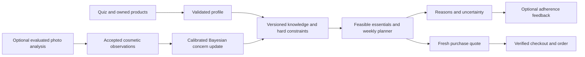

# Avyora competitive strategy — India desktop website
9 October 2026

## Decision

Avyora should aim first to deliver an exceptionally trustworthy routine-to-purchase experience for Indian customers who are confused by ingredients, already own products and have a limited budget.

Permanent number-one status cannot be guaranteed. “Best” needs measurable customer outcomes, evidence and an operating process. This review is not a sales/revenue ranking, independent formulation-quality verdict or claim that Avyora already beats established brands.

**Current verdict, updated to reflect the owner's scope:** products will be supplied later. Missing product photography, formulations, stock and product evidence are planned dependencies, not a criticism of this stage. Avyora has useful engineering foundations, but its desktop experience and recommendation infrastructure still need work. The recent audit found 22 issues, including safety/privacy failures; those remain actionable independently of when the catalogue is populated. Validated production Bayesian parameters are a separate knowledge dependency.

Desktop remains the current scope; mobile comes after owner desktop acceptance. A desktop milestone is not proof of industry-wide leadership.

## Research scope and confidence

Reviewed current official homepages, selected product pages and public AI entry points for Minimalist, Dot & Key, The Derma Co, Foxtale, Deconstruct and Re’equil. These are relevant benchmarks for different customer-facing capabilities, not an exhaustive ranking of India's skincare industry.

Competitor observations below mean the capability/content was visible on the reviewed public pages. Their clinical/accuracy claims are self-published and were not independently validated here. I did not upload faces, make purchases, inspect their code or complete every authenticated journey. Absence from a sampled page does not prove absence from a brand. Avyora observations come from the local code and desktop audit.

## Competitor comparison

| Benchmark | Observed public strengths | Avyora today | Required response |
| --- | --- | --- | --- |
| Minimalist | Ingredient/concern discovery; a sampled moisturizer exposes complete ingredients, pH, intended users and directions. It also offers a skin analyzer and AI assistant. | Highlights exist; verified formulation records are empty. AI inference is incomplete. | Match product-data depth, then differentiate through owned-product handling, verified exclusions and budget transparency. [Home](https://beminimalist.co/), [sample product](https://beminimalist.co/products/vitamin-b5-10-moisturizer), [Skin Insights](https://beminimalist.co/pages/skin-insights), [assistant](https://beminimalist.co/pages/minimalist-ai-assistant). |
| Dot & Key | Discovery by category, concern, ingredient and skin type. A sampled moisturizer includes full ingredients, usage, reviews and named study context. | Search/filter controls were lost in the redesign; product proof and imagery remain incomplete. | Restore discovery and show formulation/evidence cards with understandable limits. Complete the requested visual design with Avyora assets. [Home](https://www.dotandkey.com/), [sample product](https://www.dotandkey.com/products/dot-key-ceramides-hyaluronic-hydrating-face-cream-i-repairs-skin-barrier-intense-moisturization-sensitive-dry-skin-fragrance-free). |
| The Derma Co | Concern/ingredient navigation and a publicly offered selfie assessment leading toward a regimen. Its public assessment markup includes contact fields before View Report. | Photo capture infrastructure exists but no evaluated analyzer produces results. | Do not compete on the presence of a selfie button. Aim for optional, privacy-conscious assistance with usable quiz-only results and validated task-specific performance. [Home](https://thedermaco.com/), [assessment](https://thedermaco.com/pages/skin-assessment). |
| Foxtale | Concern shopping, product demonstrations, benefit/texture communication and merchandising that connects products into a routine. | Empty editorial-image slots and catalogue imagery make the storefront feel unfinished. | Show real textures, packaging and product use. Build a coherent routine journey with clear essentials and optional additions. [Home](https://foxtale.in/), [sample product](https://foxtale.in/products/oil-balancing-moisturizer). |
| Deconstruct | Beginner-oriented product explanations, routine entry points, an under-₹499 discovery collection and visible delivery-check actions. | Budget handling exists but greedy selection can miss an affordable complete core. | Make affordability functional: find a feasible core first, explain delivered cost and offer verified substitutes. [Home](https://thedeconstruct.in/), [sample product](https://thedeconstruct.in/products/gel-sunscreen-for-oily-skin). |
| Re’equil | The sampled sunscreen page includes full ingredients, finish information, directions, sizes, pincode delivery checking and COD information. | Checkout foundations exist; the stock-backed browser journey is not fully verified and support details remain unconfirmed. | Remove uncertainty before purchase: verified availability, delivery estimate, final charges, usable policies and dependable order support. [Sample product](https://www.reequil.com/products/ultra-matte-dry-touch-sunscreen-gel-spf-50-pa). |

**Implication:** established competitors already expose substantial product information and purchase assistance. Adding “AI” to Avyora is not enough. Its better opportunity is the quality and honesty of the decisions connecting the quiz to the basket.

## Where Avyora can earn a distinction

These are proposed advantages to build and validate, not claims that every competitor lacks them.

### 1. A routine that respects what the customer already owns

Accept an owned product, resolve its actual ingredient information and distinguish verified, partial and unknown coverage. Preserve suitable items instead of replacing them automatically with Avyora products.

Do not promise compatibility from a name, category or incomplete list. Explain what could not be checked. An owned active disguised as a moisturizer must still pass the same constraints.

**Customer benefit:** fewer unnecessary purchases.
**Validation:** independent routine review; user testing of how uncertainty is understood; fewer avoidable substitutions.

### 2. Budget means a feasible plan and a transparent basket

Find the best valid essentials combination across the whole budget. Show product spend, shipping, applicable charges and final delivered total separately. Let the customer choose whether the limit applies to products or delivery-inclusive spend.

A lower-cost, suitable routine should remain available even when a more expensive item matches a concern slightly better. No false discounts or gift thresholds. Optional items stay optional.

**Validation:** synthetic feasibility tests, live quote consistency and observed checkout surprise rates. Set prices and offers from approved business rules, not competitor coupon copying.

### 3. Every recommendation has a useful explanation

Explain:
- why the item is included;
- why another item was excluded;
- which answer affected the decision;
- which formulation/directions were reviewed;
- what information is unknown;
- what changing budget or complexity changes.

Do not display statistical certainty without validated calibration. Cosmetic appearance observations must not turn into diagnoses.

**Validation:** ask users to explain the recommendation back in their own words; reject persuasive explanations unsupported by the decision trace.

### 4. A real weekly plan the customer can follow

Show actual AM/PM steps for each day, approved usage limits and product-specific introduction rules. Include owned products in whole-plan checks.

Support a simple essentials routine, missed-day handling and optional tolerance/adherence feedback using approved guidance. Avoid inventing frequencies when usage data is missing.

**Validation:** zero hard violations in the approved test matrix; qualified review of representative cases; voluntary adherence feedback distinguished from clinical outcome evidence.

### 5. Product proof that is easy to inspect

Create a product facts/evidence panel for every published SKU:
- exact product and formulation version;
- full ordered INCI and declared concentrations where verified;
- explicit unknowns;
- approved directions and reviewer/source;
- suitable-use boundaries and unresolved suitability;
- texture, fragrance status and finish supported by actual data;
- finished-product evidence associated with each claim;
- reviewable study context and limitations where a claim uses a study;
- real packaging, product photography and manufacturing/business details.

Ingredient literature alone must not become a finished-product result claim. Competitor formulations must never be imported as Avyora's own.

### 6. Respectful personalization

Allow the visitor to obtain a provisional routine without a forced marketing signup. Ask separately for saving, optional photo processing and marketing.

Keep quiz answers out of personally linked analytics. Make deleting an image an observable, retryable operation. Publish promises only after the system enforces them.

**Validation:** privacy tests cover errors, logs, queues, retention and withdrawn consent; guest routine completion works without newsletter signup.

## Desktop experience to build

Keep the owner's selected Nuvé visual direction and measured desktop layout. Add original Avyora photography and content within it; preserve commerce and discovery features.

The hero should offer a clear route to building a routine and a clear route to shopping. Below it, customers should quickly find products, actual proof, how personalization works and delivery/support information. Educational or editorial sections must not make product discovery unnecessarily difficult.

| Journey | Requirement |
| --- | --- |
| Search | Accessible search for product, ingredient and concern; helpful spelling/alias handling; clear no-results state |
| Filter | Category, concern, skin type and verified product attributes; clear-all and URL persistence |
| Compare | Compare up to three products on price per consistent unit, ingredient/usage data and verified finish attributes |
| Product page | Real imagery, correct size/price, live availability, delivery estimate, usable directions, evidence and genuine reviews |
| Routine result | Owned/essential/optional distinction, actual weekly plan, reasons, unresolved knowledge and fresh basket quote |
| Basket | Accurate quantities, explained offers/charges and visible out-of-stock/price-change recovery |
| Checkout | Guest path, configured payment methods, preserved input, reliable reconciliation and recoverable failures |
| After purchase | Tracking, invoices, support, policy access and optional routine feedback |

This is a product-experience target. Competitor backends, payment reliability and customer service were not tested, so Avyora must measure its own results rather than proclaim superiority.

## AI and architecture

Retain the existing Next.js modular monolith. Keep cacheable public pages, narrow client components, browser-side quiz computation and authoritative server-side purchase verification.

Recommended flow:

- Knowledge rules and approved product data determine eligibility.
- Small Bayesian updates use validated likelihoods, explicit missing evidence and one accepted contribution per correlated group.
- No runtime LLM is needed for the routine finder or grounded educational assistant.
- A vision model is separate: license, scope, evaluation, calibration, quality rejection and private storage must be established before enabling it.
- Face images do not determine pregnancy, allergy, prescription use or medical diagnosis. Those constraints come from appropriate declared information and approved rules.
- Human review and user research provide the evaluation standard. A face-scan score is not a substitute for product evidence.
- Never optimize sales margin ahead of eligibility or safe plan constraints.

The immediate engineering work is to fix A01–A15 and A22 from the re-audit, not replace the architecture.

## Product and business work the website cannot manufacture

A credible skincare business also needs actual product quality, dependable supply, packaging consistency, meaningful evidence, customer support and sustainable delivery economics.

Choose a focused launch range whose formulations, claims, assets and stock can all be verified. Expand only as new products meet the same standard. A large mock catalogue does not create a trustworthy range.

Suggested responsibilities:
- Owner/product lead: target customer, business policies, launch scope and approved pricing.
- Qualified formulation/product reviewers: product dossiers, directions, claim support and safety boundaries.
- Engineering: audit repairs, deterministic recommendations, privacy and commerce correctness.
- Design/content: original approved assets, product explanations and accessible desktop journeys.
- Operations/support: stock accuracy, dispatch, customer response and issue resolution.
- Research: customer interviews and blinded comparative tasks.

One person may hold several responsibilities, but each needs an accountable owner.

## Measuring “top” without inventing a ranking

Proposed internal scorecard; weights are strategic choices, not industry statistics. Score only from evidence. Unknown results stay unknown.

| Dimension | Weight | Evidence to collect |
| --- | ---: | --- |
| Product truth and traceability | 25 | Coverage of verified formulation, usage and claims for published SKUs |
| Recommendation safety and usefulness | 25 | Hard-invariant tests, qualified routine review, feasible-budget coverage, understandable exclusions |
| Shopping and delivery reliability | 20 | Valid checkout completion, reconciliation failures, stock surprises, dispatch performance and support outcomes |
| Customer task success and accessibility | 15 | Find/compare/buy/routine tasks, keyboard completion and comprehension |
| Performance and privacy | 10 | Real-user speed, bounded processing, retention/deletion results and absence of sensitive telemetry |
| Learning and repeat use | 5 | Voluntary routine return, repeat purchase and reason-coded customer feedback |

**Safety/privacy failures override the weighted score.** A beautiful site cannot compensate for invalid recommendations.

Suggested acceptance targets:
- Every published product has the required verified data or clearly stated unresolved fields; unresolved safety information blocks recommendations where necessary.
- No hard-constraint failure in the approved test matrix; every new failure gets a regression case.
- Initial moderated desktop usability target: at least 90% task completion for a defined task set. Small research samples are directional, not proof of market leadership.
- Product/quote/order amounts agree in all acceptance cases.
- Field performance at the desktop 75th percentile: LCP at most 2.5 seconds, INP at most 200 ms and CLS at most 0.1. These are Google's good-experience thresholds, not competitor measurements. [Web Vitals guidance](https://web.dev/articles/vitals).
- Deletion and retention meet the published policy under retry/failure tests.
- Establish real funnel, repeat-use, delivery and support baselines before setting growth targets. Do not invent competitor conversion rates or copy purported industry averages.

A larger average order value alone is not success. Track whether the customer bought an appropriate plan, understood it and received dependable service.

## Suggested 90-day sequence

Timing depends on team capacity, owner data and qualified review; these are planning windows rather than guaranteed delivery dates.

| Window | Focus | Exit condition |
| --- | --- | --- |
| Days 1–30 | Resolve release-critical audit issues; gather product dossiers; finish approved hero/product assets; restore discovery | Safety/privacy gates pass; launch-range data and assets are reviewable; stock-backed sandbox commerce works |
| Days 31–60 | Complete product proof panels; owned-product flow; feasible budget selection; weekly-plan UX; fresh saved-routine quotes | Qualified routine review and desktop usability tests demonstrate useful decisions |
| Days 61–90 | Run comparative customer tasks; refine weak journeys; establish real operating metrics; evaluate optional photo integration | Evidence-backed improvements ship; scan remains disabled unless its independent readiness criteria pass |

Do not make the final window dependent on launching a scan. A reliable quiz and verified products can be released first.

## How to keep improving after launch

This is a proposed operating process, not an automation already running.

- Weekly: review safety exceptions, failed payments, stock/price surprises, delivery issues, deletion failures and the top customer questions. Fix the highest-impact issue.
- Monthly: repeat the same competitor tasks and save dated evidence. Track new capabilities and changed policies, not just homepage decoration.
- Each research round: recruit customers from the chosen Indian segment, include beginners and people who already own products, and compare identical tasks. Randomize brand order where practical and record prior familiarity.
- Quarterly: review product/knowledge releases with appropriate reviewers, assess scan calibration if enabled and retire unsupported claims or weak features.
- Each release: recheck the desktop feature inventory so visual changes do not remove search, filters, support or account behavior.

Useful comparative tasks: find a suitable moisturizer under a stated delivered budget; understand its ingredient/direction information; build a routine around an owned product; change budget; understand an exclusion; compare two products; recover from changed stock; find delivery/refund information.

Record completion, time, confusion, confidence and purchase surprises. Do not use a small user study to claim clinical superiority or country-wide leadership.

## Positioning to validate

Proposed direction, not an approved clinical promise:

**“A clearer skincare routine for your skin, your shelf and your budget.”**

Earn it by showing customers what they can keep, what is worth adding and what the system cannot responsibly determine. Use the Nuvé design to make that experience inviting. Let verified products and dependable decisions give customers a reason to return.

Before publishing “India's best,” “number one” or comparative efficacy claims, establish an appropriate substantiated basis. The current evidence supports a development strategy, not those claims.

## Revised implementation scope: build the desktop platform before products arrive

The owner clarified that products will be added later. The immediate objective is therefore a complete, testable desktop platform with excellent customer journeys, rather than a stocked storefront. Preserve the selected current-live Nuvé visual direction and all existing customer, commerce, staff and operations capabilities. Mobile design remains deferred.

### What can be completed now

| Workstream | Concrete implementation | Acceptance before product onboarding |
| --- | --- | --- |
| Desktop design | Finish typography, spacing, navigation, interaction states, keyboard focus, motion preferences and all page templates; prepare documented image slots and crops | Review at 1280, 1440 and 1920 pixels; no overflow or inaccessible controls; every old capability has a mapped entry point |
| Discovery | Restore search and category/concern filters; add URL persistence, clear-all, comparison and honest empty states | A clearly labeled development catalogue supports find/filter/compare tasks; the empty production catalogue is usable without fabricated inventory |
| Quiz and results | Connect each answer to an approved rule or explain its informational purpose; allow back/edit; show essentials, optional additions, reasons and a weekly plan | Fixture cases prove answer mapping, coherent results and recovery; a lack of eligible products produces an honest unavailable/partial result |
| Owned products | Apply the same ingredient coverage, allergy, active and usage checks as catalogue items | A01–A03 and A08 regression cases pass; unknown coverage never becomes an assurance of compatibility |
| Budget and planning | Search for a feasible essential combination before optimizing preference; enforce every scheduled item's approved limits | A12 affordable-core fixture passes; A02 invalid plans cannot be rendered as usable, saved or added to the bag |
| Saving and purchases | Separate the saved plan from a current purchase quote; handle price changes, stock changes and retries | A22 fixture proves fresh quotes; sandbox payment/order, guest/account merge and duplicate-request cases pass |
| Privacy and resilience | Remove linked skin telemetry; scrub logs and monitoring; make deletion retryable and retention enforceable | A04–A07 failure cases pass with synthetic data, including network loss and failed object deletion |
| Optional face scan | Complete camera cleanup, cancellation, atomic upload ownership, bounded uploads and result-to-quiz integration behind a disabled production flag | A13–A15 regression cases pass; no model output or accuracy claim is fabricated |
| Education | Build versioned question/alias lookup, reviewed answer records, source display and an honest unknown-answer path | Retrieval works with labeled fixtures; only approved knowledge is available to customers |
| Reliability and SEO | Correct structured shipping messages, page canonicals, newsletter failure handling, support states and accessible loading/error states | A17, A20 and A21 checks pass; private/token pages have appropriate indexing behavior |

Development fixtures must be isolated from the production product source. Never publish fake reviews, fake before/after results, invented clinical approval or purchasable sample products. Shared eligibility, scheduling and publication logic should be tested now using synthetic records; real data should not require rewriting that logic later.

### What remains dependent on real data

Prepare schemas, validators, admin workflows and import previews now. Later, load actual SKU/variant identifiers, integer-paise prices, stock, ordered INCI with canonical ingredient identities, formulation versions, approved directions, verified attributes, licensed photography and claim-linked evidence. Review aggregates begin empty and populate from genuine moderated reviews.

A Bayesian package can be implemented and mathematically validated now, but production likelihoods, priors and calibration need defensible data and review. Do not invent probability tables merely to make the AI appear active. With missing validated parameters, use the approved deterministic rules and state the limitation. A face-scan model likewise needs a suitable license, defined cosmetic scope and evaluation before enabling it. Its output cannot determine allergies, pregnancy or prescription use.

Product onboarding acceptance is a separate gate: published records pass validation, unresolved safety fields block affected recommendations, and real quotes/stock replace fixtures. Customer-facing usefulness and actual purchase performance must then be reassessed with the launch range.

### Execution order and definition of better

1. Repair the safety, privacy and data-integrity defects first: A01–A08.
2. Complete recommendation plumbing and feasibility: A09–A12 and A22. Use validated fixture parameters for tests, not as production evidence.
3. Finish optional scan infrastructure: A13–A15. Keep the analyzer disabled until independently ready.
4. Restore desktop discovery, complete templates and fix A17–A21. A16 campaign/product photography remains an asset dependency; A19 requires the review integration now and real reviews later.
5. Run the complete database-backed desktop acceptance matrix, then onboard real products and repeat customer tasks against the benchmark sites.

Aim to outperform on five defined tasks: finding an option, understanding a recommendation, reusing an owned item, meeting a budget and recovering from a failed action. Record completion, time, confusion and correctness using the same task conditions. No comparative superiority claim follows from feature count or local tests alone.

Keep cacheable public HTML and assets on the CDN, load interactive quiz state in the browser and share the small deterministic engine across browser/server. Static generation and client interactions serve different purposes. Making every page client-only does not inherently reduce cost and can hurt discovery and initial loading. Keep payment verification, inventory, consent enforcement and authoritative quotes on the server; measure caching and request volume before judging hosting savings.

This scope is a developer implementation plan, not a claim that these changes have been implemented. The original re-audit remains a dated record of observed defects; it should not be rewritten to imply fixes or a new verification run.

## Supporting local evidence

[Desktop re-audit and 22 findings](<../docs/avyora-desktop-re-audit-2026-10-09.md>).
[Empty verified formulation registry](<../src/data/formulations.ts#L20>).
[Current knowledge registries](<../src/data/knowledge.ts#L112>).

The comparison reviewed official public pages on 9 October 2026. Prices, promotions and features can change; this document deliberately avoids declaring a price winner or validating a brand's clinical/AI claims.
