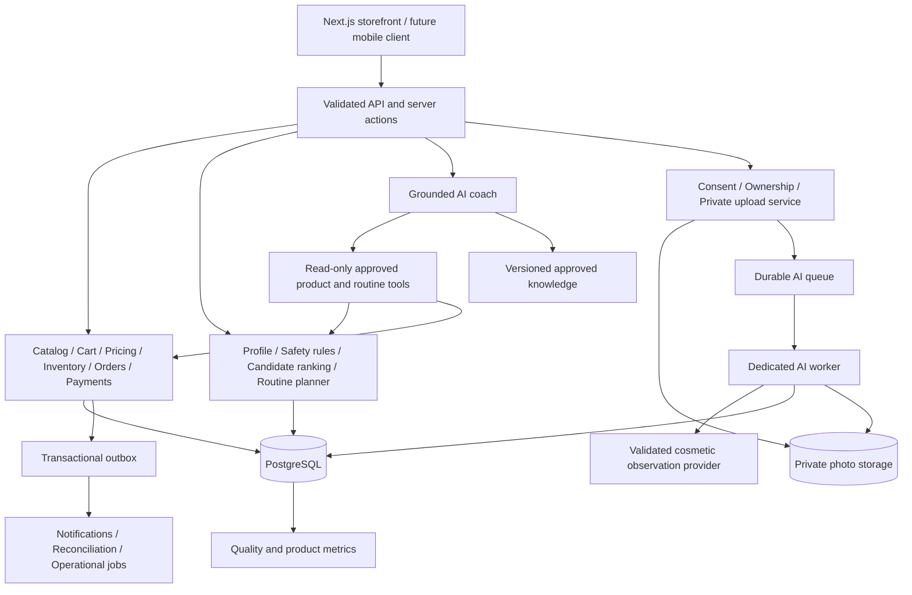

# Avyora: product, engineering, AI and routine-finder audit

Reviewed 7 October 2026. Repository HEAD: `6114543`.

## Verdict

Avyora currently presents a more mature brand than its product experience supports. The commerce foundation is substantially stronger than the skincare personalization. Adding AI to the current routine finder would amplify its mistakes.

The clearest opportunity is a small, understandable routine that customers can afford, tolerate and follow, with useful follow-up. A scanner is an acquisition feature; trustworthy recommendations and measured customer outcomes are the retention feature.

This is a scoped audit of the repository, selected live storefront pages, routine outputs and available automated checks. It is not a claim that every defect has been discovered, a penetration test, a clinical validation, or an audit of the actual formulations and business operations. Confirmed code defects, observed live behavior, incomplete features and strategic suggestions are distinguished below. No purchase was submitted. A temporary cart item used for verification was removed.

## Evidence and checks

- Type check: passed.
- Lint: passed with 23 warnings, including unsafe `any` use and some unused imports.
- Full tests: 402 passed, one timed out across 42 files. The timed-out payment test passed when its file was rerun separately: 17/17. Treat this as a reproducibility/import-time problem until investigated, not evidence that the payment logic is wrong.
- Standard Windows build command: fails before compilation because `NODE_ENV=production next build` uses Unix environment syntax. A direct Next build compiled successfully and passed its type/lint stage, then failed prerendering `/journal` with `ECONNREFUSED` from the configured database. A complete production build is therefore unverified in this environment; this does not establish that the deployed database is down.
- Live inspection: home, routine-finder entry, cleanser and retinal product pages, usage accordion and cart.
- Executed the actual routine engine with synthetic beginner, irritated and very reactive profiles. These checks did not submit health information through the live quiz.

### Reproduced routine outputs

| Synthetic profile | Actual result | Why it matters |
| --- | --- | --- |
| No existing routine, normal skin, "Just Want a Simple Routine" | 6 morning steps, 6 evening steps, 9 distinct products, catalogue total ₹4,821 | A beginner is given a large purchase list and exfoliation rather than a genuinely small routine. |
| Pigmentation, experienced, currently irritated | Vitamin C in the morning and PHA exfoliation in the evening; warning says "barrier repair only" | The explanation contradicts the products. |
| Fine lines, experienced, very reactive | No retinoid, but still PHA, 10% niacinamide and several additional layers | Exclusion is applied only to the retinoid; overall tolerability is not constrained. |
| Only dark-spot severity changes from "no" to "significant" | Same purchase list | A prominently asked question has no effect on selection. |
| Only sun exposure or consistency changes | Same purchase list | Answers are stored in the profile without affecting the prescription or schedule. |

₹4,821 is the sum of catalogue first-size prices, not a quote of current database prices, shipping or a suggested budget.

### Reproduced cart failure

On the retinal product page, select 90ml at ₹899, increase quantity to 3, then add to cart. The cart contains quantity 1 and displays ₹399. Checkout has its own server price calculation, so this is a display and quantity failure, not evidence of a ₹399 charge for 90ml.

## Prioritized findings

P1 means resolve before a commercial launch or wider recommendation rollout. P2 means material correctness, trust or usability work. P3 means hardening or future integration work. These priorities are engineering/product judgments, not legal classifications.

| ID | Priority / evidence | Finding and required change | Source |
| --- | --- | --- | --- |
| 01 | P1 / reproduced | Irritated-skin mode still selects vitamin C and an exfoliant while saying barrier repair only. Make tolerability exclusions apply to the complete plan before any ranking; require clinician-reviewed rules. | `src/lib/routine-engine.ts:39`, `:294`, `:400` |
| 02 | P1 / code | Pregnancy "Prefer not to say" has value `no`. Use distinct `yes`, `no`, `unknown`; unknown must not establish eligibility for a retinoid. Ensure the selected UI state is distinct too. | `src/app/routine-finder/page.tsx:176` |
| 03 | P1 / live + code | Generic usage copy says twice daily for the retinal product and every other product without CMS instructions. Replace with mandatory, product-specific approved directions; do not allow publication of an active product without them. | `src/app/products/[slug]/product-client.tsx:256` |
| 04 | P1 / live + code | Cart calculates from base `item.price`, ignoring selected-size price, sale price and database override. Live 90ml retinal: page ₹899, bag ₹399. Pass SKU identifiers and quantities through cart state; resolve all display prices from the shared pricing service. | `src/components/cart-drawer.tsx:13`, `:106` |
| 05 | P1 / live + code | Quantity selector is ignored by Add to Cart: the handler passes no quantity and the provider adds exactly one. Extend the cart command to accept quantity and verify against the chosen SKU. | `src/app/products/[slug]/product-client.tsx:237`; `src/lib/store.tsx:174` |
| 06 | P1 / code + engine | "Minimal" beginners get 12 displayed daily steps and 9 products. `routineLevel` does not cap step count. Start with an essential core; explicit optional additions require a reason. Let the customer choose complexity separately from experience. | `src/lib/routine-engine.ts:108`, `:215`, `:272` |
| 07 | P1 / live + code | Banners promise Buy 2 Get 3rd Free, gifts, bundle discounts and cashback. Order totals receive no basket promotion; no credit ledger or gift fulfillment path was found. Remove unsupported offers or implement eligibility, allocation, refund behavior and fulfillment end to end. | `src/components/layout/announcement-bar.tsx:6`; `src/app/home-client.tsx:18`, `:168`; `src/lib/orders.ts:239` |
| 08 | P1 / code | "Complimentary delivery, always" conflicts with ₹79 shipping below ₹1,199. Bundle-specific free delivery is not represented in order totals. Use one source for offer copy and checkout conditions. | `src/app/home-client.tsx:170`; `src/lib/money.ts:42` |
| 09 | P1 / live + source | Retinal claims "zero irritation"; other copy includes categorical promises without evidence visible in the repository. Remove absolute claims unless the finished formulation and claim wording have appropriate substantiation. Ingredient literature alone does not prove a finished product claim. | `src/data/mock-data.ts:273`; product descriptions and taglines |
| 10 | P1 / source + live footer | Policy pages contain `[TO CONFIRM]`; support WhatsApp is `+91 99999 99999`. Fill real business details, support routes, dispatch and return terms, and have the applicable privacy/consumer requirements reviewed before launch. | `src/app/(legal)/*/page.tsx`; `src/components/layout/footer.tsx:27` |
| 11 | P2 / reproduced | Very reactive users still receive exfoliation and a multi-product routine. Tolerability must govern all actives and additions, not only retinoid eligibility. | `src/lib/routine-engine.ts:204`, `:215`, `:272` |
| 12 | P2 / code | Routine cards, total and purchase list use compiled catalogue prices rather than current storefront prices. An admin price change can disagree with the quiz. Resolve selected SKU prices with the same service used by collections and checkout. | `src/app/routine-finder/page.tsx:249`, `:352`, `:492` |
| 13 | P2 / code | Routine finder has no stock input and selects first size unconditionally. It can encourage buying unavailable variants. Filter or substitute at SKU level; permit an honest empty treatment slot instead of an unsuitable fallback. | `src/lib/routine-engine.ts:87`; `src/app/routine-finder/page.tsx:356` |
| 14 | P2 / reproduced + code | Dark-spot severity, consistency and sun exposure do not influence product selection; budget, owned products, medication use and allergies are not asked. Shorten useless questions and add constraints that actually change the decision. | `src/lib/routine-engine.ts:108`; `src/lib/routine-types.ts`; quiz question list |
| 15 | P2 / source | Completed results exist only in page state for display. Saving discards the returned ID and no result-read screen was found. Reload loses the visible routine. Add authenticated retrieval, anonymous ownership and a save status; do not share raw answers publicly. | `src/app/routine-finder/page.tsx:289`, `:306`; `src/app/routine-finder/actions.ts`; `src/lib/activity.ts:101` |
| 16 | P2 / code | Saving accepts arbitrary client answers and arbitrary client result JSON, with no schema or route-specific rate limit. Same-origin abuse can pollute analytics and consume storage. Validate bounded answers, recompute the result server-side, use idempotency and rate limits. | `src/app/routine-finder/actions.ts:15`; `src/lib/activity.ts:104` |
| 17 | P2 / code | Quiz saves pregnancy and skin answers by default; the save path has no explicit saving preference, consent record or retention enforcement. Policy mentions quiz answers, but this does not implement a data lifecycle. Separate session-only guidance from optional saved profiles; implement deletion/expiry and inventory the data in account settings. | `src/app/routine-finder/actions.ts:22`; `src/db/schema.ts:380`; `src/app/account/data/page.tsx` |
| 18 | P2 / source | Ingredient strings are highlights, not full INCI. Resolver uses exact token equality, so strings such as "Niacinamide 10%" and "Hyaluronic Acid (5 Weights)" can miss canonical dictionary entries. Store canonical ingredient IDs and full formulation data; expose unknown coverage rather than implied safety. | `src/lib/interactions.ts:163`, `:188`; `src/data/mock-data.ts` |
| 19 | P2 / source | The interaction evaluator is not called by routine generation. Product-page cross-selling and the quiz are separate recommendation paths. Share safety constraints across routine selection, substitutions and personalized product suggestions. | `src/lib/routine-engine.ts`; `src/lib/interactions.ts:54`; `src/modules/recommendations/recommendations.ts` |
| 20 | P2 / source | Cross-selling gives a pair supported by only two orders a score of at least 120, overwhelming concern fit. This can reflect bundles or promotions, not skin suitability. Keep non-personal cross-selling distinct, apply profile safety first, and later use normalized support rather than raw counts alone. | `src/modules/recommendations/ranking.ts:27`, `:66` |
| 21 | P2 / source | Retinoid and acid coexist in one evening list; separation lives in prose. Tests only check that the words "retinol night" exist. Represent actual days and validate no same-session conflict and achievable weekly schedules. | `src/lib/routine-engine.ts:272`; `src/lib/__tests__/routine-engine.test.ts:90` |
| 22 | P2 / live | The live logo is a placeholder and the hero photograph visibly carries another brand. Product photographs are generic Unsplash imagery. Replace with real packaging, texture and usage photography; customers need to see what they will receive. | `src/components/logo.tsx`; `src/app/home-client.tsx:14`; `src/lib/placeholder-images.json` |
| 23 | P2 / source | Newsletter form has no action, handler or named email input, so Join does not subscribe anyone. Add a consent-aware subscription flow with success/error states, or remove the control. | `src/components/layout/footer.tsx:96` |
| 24 | P2 / reproduced | Standard build command fails on Windows. Use `next build` (Next selects production for builds) or a portable environment-setting mechanism. | `package.json:7` |
| 25 | P3 / source | Storage writes in the provider are not guarded; valid JSON with the wrong shape is accepted during hydration. Storage-disabled browsers or malformed cart/wishlist values can break the interface despite the comment promising resilience. Guard reads and writes, validate shapes and preserve an in-memory fallback. | `src/lib/store.tsx:67`, `:89`, `:129` |
| 26 | P3 / source | Server cart is mirrored but never fetched back by this provider. Wishlist loads on mount only, so same-page session changes need review. Define a server cart ownership and merge policy, and synchronize when the authenticated identity changes. | `src/lib/store.tsx:112`, `:144` |
| 27 | P3 / source | CMS object storage can return an external public media URL, while Next Image/CSP only allow the present image hosts. Configuring a new media domain requires both policies to be updated and verified. | `next.config.ts:48`; `src/lib/security.ts:113`; `src/infrastructure/storage/s3-storage.ts:76` |
| 28 | P3 / test/design | Existing tests verify resolution and wording but do not catch the above clinical contradictions, simplicity failures, displayed price divergence or quantity behavior. Add targeted invariants and browser tests around these behaviors. | `src/lib/__tests__/routine-engine.test.ts`; cart/product components |
| 29 | P2 / observed environment limitation | With a database URL configured but unreachable, static journal generation fails and stops the production build. Verify the intended local/build database, migrations and build-time access; make the offline-build policy explicit. Do not turn a production database outage into cached empty content merely to pass a build. This is not evidence that the deployed database is unavailable. | `src/app/journal/page.tsx:17`; `src/modules/cms/content-read.ts:114` |

## Competitive position

Minimalist already offers [Claré, its AI assistant](https://beminimalist.co/pages/minimalist-ai-assistant) and [Skin Insights](https://beminimalist.co/pages/skin-insights). Its [values page](https://global.beminimalist.co/pages/our-values) emphasizes ingredient concentrations, sourcing and formulation transparency. AI and scanning are already category features.

Dot & Key's [storefront](https://www.dotandkey.com/) and [shop-all collection](https://www.dotandkey.com/collections/shop-all) organize a broad catalogue around concerns, skin types and recognizable product ranges. The strategic lesson is easy product discovery and a coherent brand experience, not adding more catalogue entries to Avyora.

My recommended positioning: **a practical skincare routine for your skin, budget and tolerance, with help sticking to it.** Validate that positioning with target customers before turning it into a public promise.

Start with one customer segment rather than trying to own acne, pigmentation, aging, body, hair and every K-beauty trend immediately. A plausible segment to test is Indian beginners confused by active ingredients and long routines. Research willingness to pay, real product availability and repeat purchase before committing to it.

What can earn a reason to switch:

1. A small number of genuinely differentiated finished formulations with proof, not dozens of impressive ingredient names.
2. Full INCI, exact active form/concentration, approved use, formulation testing and clear limitations. Publish testing methods/results only when actually available.
3. A finder that sometimes says "you already own what you need" or "we don't have an appropriate treatment." This costs an immediate upsell and builds trust.
4. Clear total spend and optional upgrades; no forced toner, essence or eye patches to complete a routine.
5. Follow-up on tolerability, adherence and customer-reported progress, with realistic expectations approved by a qualified reviewer.
6. Genuine verified-purchase reviews, relevant skin context with consent, transparent negative feedback handling and no invented social proof.
7. Reliable delivery, accessible support, simple returns and transparent offers.

## Recommended architecture

Keep the existing **modular monolith**: one Next.js commerce deployment with explicit domain boundaries. Keep PostgreSQL authoritative for users, orders, inventory, prices and saved recommendation decisions. Add an independently runnable background worker for AI; it can initially live in the same repository.

Do not introduce Kubernetes, Kafka, Spark, multiple databases or a microservice per domain at this stage. Use measured bottlenecks and operational ownership to justify future extraction.

Preserve the current strengths: transactionally reserved inventory, integer money arithmetic, server-side checkout prices, payment state handling, audit records, outbox retries, CMS versions and owner/manager controls. Read old architecture documents carefully: `CURRENT_ARCHITECTURE.md` explicitly describes an older baseline, and `scaling.md` contains historical missing-backend claims that no longer describe the code.

Suggested boundaries: `catalog`, `commerce`, `customer`, `skin-profile`, `recommendation`, `ai-coach`, `skin-analysis`, `content`, `operations`. Move `lib` functions behind those boundaries gradually as touched. Do not perform a large folder rewrite as a substitute for fixing behavior.

Important data additions:

| Entity | Essential information |
| --- | --- |
| Product/formulation version | SKU, complete INCI, canonical ingredients, exact active form/concentration, approved instructions, tolerability attributes, documented exclusions, evidence references, publication status |
| Skin profile version | Self-reported skin behavior, sensitivity separately from oiliness, priority concerns, allergies, existing products, relevant medication context, pregnancy answer including unknown, budget, preferred complexity, source of each value |
| Rule version | Reviewed condition/action, evidence, reviewer, effective date, severity and reason code |
| Recommendation run | Input snapshot/reference, rule/catalog versions, candidate exclusions, ranked candidates, chosen steps, day-by-day schedule, price snapshot, reason codes, timestamps |
| Consent record | Purpose, notice version, timestamp, withdrawal and scope; separate saving, photo processing, progress photos, marketing and any training use |
| Scan session | Owner, private object reference, expiry, consent reference, status, image-quality findings, provider/model version, result, failure/abstention reason |
| Progress check-in | Customer-reported tolerability/adherence, routine version, optional separately consented photo, requested changes |

Cache public catalogue data. Key any personal recommendation cache by profile, rule and formulation versions, or do not cache it initially. Never use a public shared cache for faces or personal skin histories. AI cannot mutate inventory, apply discounts or decide payments.

## Routine finder redesign

Use this pipeline: **validate answers → safety eligibility → suitable candidates → budget and ownership constraints → rank → construct schedule → validate complete routine → explain → optionally save.**

1. Keep one typed answer schema shared by UI and server. Use IDs, not substring matching against display text. Unknown is a first-class answer.
2. Separate oily/dry/combination behavior from sensitivity. "Sensitive" is currently mutually exclusive with oily/dry in the quiz, although a customer needs to express both dimensions.
3. Ask a short branching quiz: goal, skin behavior/uncertainty, reactivity, current irritation, existing routine/products, relevant exclusions, spend and preferred effort. Ask detailed follow-ups only when they change the result.
4. Default to a simple essential plan. The AAD describes cleansing, moisturizing and protection as a budget-conscious three-step approach; a qualified reviewer must approve the actual formulas and selections. [AAD guidance](https://www.aad.org/public/everyday-care/skin-care-basics/care/skin-care-budget).
5. Make optional treatments and cosmetic layers explicitly optional. Do not infer that an experienced customer wants more products.
6. Apply hard exclusions before scoring. Include allergy matching against full formulation data, unknown contraindication handling and clinician-reviewed restrictions. If metadata is missing, do not invent eligibility.
7. Rank suitable options by concern fit, tolerability, budget, compatibility with owned products, texture preference and known availability. Keep commercial ranking from overriding suitability. Publish numeric weights only after evaluation; no arbitrary weights are clinically validated by being written in code.
8. Produce an actual weekly plan with introduction phases, recovery days and substitution paths. The present prose-only separation is too easy to misread. AAD cautions that current products and skin type affect safe exfoliation. [AAD exfoliation guidance](https://www.aad.org/public/everyday-care/skin-care-secrets/routine/safely-exfoliate-at-home).
9. Show a short trace: why this product, why this frequency, what was omitted, what information is missing and what the user already owns. Avoid vague "cellular repair" explanations unrelated to their answers.
10. Let users remove a step, substitute within budget, choose an available size, correct the profile and save an authorized result. Revalidate safety after every edit.
11. Ask at follow-up whether they actually used the plan and whether it caused irritation. Never escalate actives simply because a customer bought them.

Minimum verification: irritated profiles do not get excluded actives; pregnancy unknown never enables blocked retinoids; budget and complexity caps hold; every selected size is valid; schedules obey reviewed constraints; no contraindicated substitutions; all displayed totals use the pricing resolver; raw personal answers cannot be retrieved across accounts.

## AI coach: first useful AI feature

Build a grounded routine assistant before scanning. It should explain a validated routine, help simplify it, answer approved product questions, compare suitable textures and help users understand their schedule.

- Retrieval uses approved, versioned product/formulation information and reviewed educational content.
- Server-side tools return allowed products, current prices/stock and validated routines. The language model explains those outputs rather than independently prescribing a product list.
- Structured responses carry product IDs, reason codes and evidence references. Validate IDs, claims and exclusions after generation too.
- An uncertain question receives a clarifying question or a bounded answer. A request involving severe symptoms, prescription changes or diagnosis follows a clinician-reviewed escalation policy.
- Keep order/support assistance behind normal user authorization, with read-only tools at first.
- Add timeouts, request/cost limits, prompt-injection handling, groundedness checks and an evaluation set before enabling broad use.
- Have explicit failure behavior: show the deterministic routine when the AI provider is unavailable. Use templated explanations where they are sufficient.

This is retrieval-augmented generation, but the retrieval is only as trustworthy as the underlying approved information. A pile of scraped skincare blogs is not an adequate knowledge base.

## Optional face scan

The current implementation is a seam: `configuredSkinAnalyzer()` returns `null`, no user upload/request interface was found, and the job handler discards the analyzer result. It is not an existing face-scanning feature.

The proposed customer flow:

1. Explain the limited cosmetic purpose and offer quiz-only guidance.
2. Obtain separate, recorded consent before capture/upload. Do not use it for identity recognition.
3. Provide capture guidance and assess lighting, sharpness, framing, filters/makeup and occlusion. Reject unsuitable photos rather than pretend to analyze them.
4. Upload to a private bucket using a short-lived authorized upload; strip unnecessary metadata, limit size/dimensions and validate decoded media.
5. Create an owner-bound scan session and enqueue a job. Return a session ID; authenticated status polling shows queued/processing/complete/failed.
6. Run a provider evaluated for the exact intended cosmetic outputs. Store structured observations, quality information, model/version and calibrated uncertainty; support "cannot assess."
7. Ask the customer to confirm observations before incorporating them into the skin profile. Self-reported sensitivity, allergies, medication use and pregnancy are not inferred from a face.
8. Re-run the same routine safety/selection pipeline. A scan result must never bypass exclusions.
9. Delete originals after the disclosed processing window unless separately retained for progress tracking. Implement actual object deletion and result expiry, including withdrawal behavior for queued/running jobs.

Do not promise diagnosis, exact hydration, hidden medical conditions, hormone status, or an objectively measured "skin age" from an ordinary selfie. Do not show a made-up 93% skin score. Start with a narrowly evaluated cosmetic observation task, and label results accordingly.

Evaluation must include relevant Indian skin tones, devices, lighting, makeup and image quality, with expert-reviewed references for the actual use case. Research has found performance disparities on darker skin in dermatology AI; that motivates evaluation but does not establish any proposed cosmetic scanner's accuracy. [DDI study](https://pubmed.ncbi.nlm.nih.gov/35960806/). Do not assume a public research dataset is licensed for commercial model training; verify terms separately before selecting data.

Architecture gaps to close before launch:

- Current `Permissions-Policy` denies camera access. Adjust only the necessary origin capability once capture is implemented; an image-file upload can be an alternative.
- Current storage interface has `publicUrl` and no deletion or signed private access. Create a separate private-photo abstraction; do not reuse public CMS media paths for faces.
- A consent timestamp in a job payload is not sufficient authorization: verify consent record, notice version, owner and withdrawal at enqueue and processing.
- AI job results need a persisted result/status model, ownership checks, idempotency, retry policy and retention cleanup.
- The current queue normally runs after checkout and through a daily cron backstop. Face analysis needs an independently triggered worker with a defined response-time target and observable queue age. Users must not wait for the next checkout or the next day's cron.
- Set concurrency and spending limits; track latency, failures, rejection/abstention rate and drift. The commerce path must remain responsive when AI is slow.
- Have the specific privacy notices, minors policy, provider processing terms and applicable DPDP implementation requirements reviewed. India's rules have phased commencement; a checklist alone does not establish compliance. [MeitY rules source](https://www.meity.gov.in/documents/act-and-policies/digital-personal-dataprotection-rules-2025gDOxUjMtQWa?pageTitle=Digital-Personal-Data-ProtectionRules-2025).

## Storefront changes worth making

- Replace stock imagery and placeholder branding before spending on customer acquisition.
- Put one clear product/customer promise and "Find my routine" near the top, supported by real proof. The homepage currently renders the entire product range before the bundle section; prioritize a small discovery path.
- Use familiar categories such as Cleanser, Moisturizer and Sunscreen rather than making customers navigate internal "Phase 1–7" terminology.
- Product pages need complete ingredients, approved directions, texture/finish, suitability and exclusions, real size comparison, delivery estimates and review submission. "Be the first to review" currently has no review submission flow found in this audit.
- Separate essential products from optional additions and show routine cost before an "Add all" action.
- Improve readability in the bag: current product labels and helper text use 8–10px type in places. Add accessible names to quantity and announcement controls and pause controls for auto-rotating content.
- Publish actual support and return details. Only show promotions that have implemented checkout and fulfillment behavior.
- Consolidate canonical site URL configuration before using a production custom domain; structured data and sitemap currently hardcode `avyora.com` while the documented deployment is on Vercel.
- Keep the initial app web-first. Add a mobile app when check-ins, reminders, progress tracking and retention justify its cost; copying the storefront into a native shell does not create an advantage.

## Delivery order and success measures

Suggested sequence, not a fixed delivery estimate:

| Phase | Deliverables | Exit condition |
| --- | --- | --- |
| 1 — Trust and correctness | Findings 01–10, shared price display, approved usage, real identity/support, portable build | Critical behavior verified in browser and tests; offers match checkout/fulfillment. |
| 2 — Routine finder v2 | Typed profiles, simple core, budget/owned-product constraints, safety rules, real schedule, stock-aware substitutes, saved retrieval | Reviewed scenario set passes, no silent constraint violations, users understand and can follow the plan. |
| 3 — AI coach | Grounded knowledge, restricted tools, structured output, evaluations, cost/latency guardrails | Unsupported claims and safety failures stay below agreed rollout thresholds; deterministic fallback works. |
| 4 — Scan pilot | Private storage, real consent/deletion, worker/results UI, validated narrow observations | Quality and subgroup performance meet documented criteria; abstention and user correction work. |
| 5 — Retention | Optional reminders/check-ins, real reviews, repeat-purchase flows, experiments | Retention and tolerability improve without forcing more products. |

Track quiz start/completion/drop-off, routine edits, essential versus optional uptake, save/return rates, adherence, customer-reported irritation, returns, repeat purchase, support load, AI cost per successful session and scan quality/abstention by subgroup. Record recommendation and formulation versions with outcomes so a regression can be traced.

Do not optimize the system only for basket size or conversion. In skincare, a larger first order that leads to irritation, confusion and no second order is a worse outcome.
