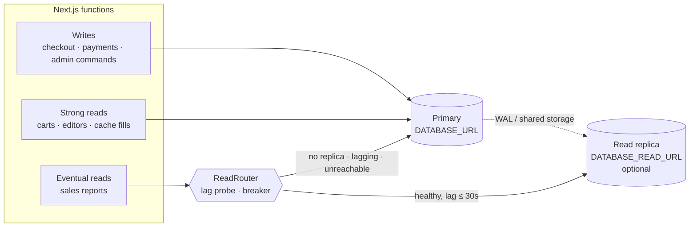

# Data architecture

PostgreSQL is the system of record. Everything else — Redis, the event
stream, the analytics landing zone, object storage — is derived from it or
sits in front of it, and can be lost without losing a customer's order.

| Store | Holds | Authoritative? | If it disappears |
| --- | --- | --- | --- |
| PostgreSQL (Neon, ap-southeast-1, PG 18) | Orders, payments, stock, prices, carts, wishlists, content, events, jobs, audit | **Yes** | Restore from backup (see below) |
| Redis (Upstash REST, optional) | Cached copies of display data, carts, content | No | Reads go to Postgres; slower, still correct |
| Object storage, media bucket (optional) | Uploaded images | Yes, for the bytes | Articles lose hero images; the storefront catalogue is unaffected |
| Object storage, analytics bucket (optional) | NDJSON copy of the event log | No | Re-export from `domain_events` (reset the watermark) |
| Kafka (optional) | Stream copy of events | No | Replay dead deliveries, or re-export |

## Reads and writes



Every read names its consistency (`readWith('strong' | 'eventual', …)` in
`src/db/index.ts`); plain `db` is the primary.

**Strong** — the primary, always:

- checkout, stock reservation, payment state, refunds
- carts and wishlists (a customer must see what they just added)
- admin editors and forms (an editor must see what they just saved)
- **every cache fill**, including display pages. A publish invalidates the
  cache and the next read refills it. From a replica still a second behind,
  that refill would put the old text back for the cache's whole TTL (an hour
  for content). Cache misses are rare, so this costs little.

**Eventual** — the replica when healthy:

- `productSales` and `dailySales` on the owner's analytics page: whole-window
  scans where seconds of lag change nothing.
- Search indexing and recommendation mining (Phase 7) will use it too.

**The router never trusts the replica blindly** (`src/db/read-router.ts`):

- lag is probed at most every 10 s; over `DATABASE_READ_MAX_LAG_SECONDS`
  (default 30) reads go to the primary until it catches up. An idle primary
  would make replay-timestamp lag look huge, so a replica that has replayed
  everything it received counts as zero.
- a connection failure reruns that read on the primary and rests the replica
  for 30 s.
- a SQL error is *not* rerun: it would fail twice, or hide a write that was
  sent to a read-only replica.

**Status:** routing, fallback and lag policy are implemented and unit-tested.
The lag query was checked against the production server (PostgreSQL 18.6).
It has **not** run against a real replica, because none exists: no
`DATABASE_READ_URL` is set, and every read goes to the primary today.
Enabling one on Neon means adding a read-only compute to the `main` branch
and setting `DATABASE_READ_URL` to its pooled connection string. On the free
plan it draws from the same monthly compute allowance.

## Connections

- Each function instance holds a small pool (`max: 5` in production, 2 in
  development) with `prepare: false`, because connections go through Neon's
  transaction-mode pooler (the `-pooler` host). The pooler multiplexes
  thousands of short-lived clients onto a few server connections.
- Migrations and backups use a **direct** (non-pooled) connection: both need
  session-level behaviour that a transaction pooler does not preserve.
- A replica gets its own pool, created only on first use.

Horizontal scaling of the app tier is therefore bounded by the pooler, not by
Postgres `max_connections`. The compute size (0.25 CU on the free plan) is the
real ceiling; see `scaling.md`.

## Backup and recovery

### What exists today (measured, not assumed)

Read from the Neon API on 2026-09-25:

| Setting | Value | Meaning |
| --- | --- | --- |
| `history_retention_seconds` | 21600 | **6 hours** of point-in-time restore |
| snapshot schedule | none | no scheduled snapshots |
| plan | free | 512 MB per branch, 10 branches |

Six hours is the whole safety net. A mistake noticed the next morning —
a bad migration, a wrong bulk price edit — cannot be undone from Neon alone.

### Added: daily encrypted logical backup

`.github/workflows/backup.yml`, daily at 02:00 IST:

1. `pg_dump` (client version 18, matching the server) in custom format,
   over a direct connection
2. `pg_restore --list` on the result, so an unreadable dump fails the job on
   the day it is taken, not on the day it is needed
3. AES-256 encryption on the runner (`openssl enc -pbkdf2`) — the dump holds
   names, addresses and phone numbers
4. upload to a private S3-compatible bucket with a SHA-256 alongside

**Status: PARTIALLY IMPLEMENTED.** The workflow is written and its YAML is
valid, but it has not run: it skips until the six `BACKUP_*` secrets are set
in the repository. Retention (30 days suggested) is a bucket lifecycle rule
to set when the bucket is created.

### Recovery objectives

| Scenario | Recovery point | Recovery time | How |
| --- | --- | --- | --- |
| Mistake noticed within 6 h | seconds before the mistake | ~15 min | Neon point-in-time restore to a new branch, verify, then promote or copy rows back |
| Mistake noticed after 6 h | last nightly dump (≤ 24 h) | ~1 h | Restore the dump into a new branch (runbook below) |
| Neon project lost | last nightly dump | a few hours | Restore the dump into any Postgres 18 (RDS, another Neon project), repoint `DATABASE_URL` |
| Redis / Kafka / analytics bucket lost | nothing lost | none | They are derived; they refill or re-export |

Orders paid between the last dump and a disaster are recoverable from the
payment provider's records (Razorpay dashboard/API) and the confirmation
emails, not from us. That is the honest limit of a nightly backup.

### Restore runbook

Point-in-time (within 6 hours), from the Neon console or API:

1. Create a branch from `main` **at a timestamp** just before the incident.
2. Point a local `.env.development.local` at the branch and check the data.
3. Either copy the damaged rows back to `main`, or make the branch the
   project's default and update `DATABASE_URL` in Vercel.

From a nightly dump:

```bash
aws s3 cp s3://$BUCKET/db/<stamp>.dump.enc . --endpoint-url $ENDPOINT
openssl enc -d -aes-256-cbc -pbkdf2 -iter 200000 -in <stamp>.dump.enc -out avyora.dump -pass env:PASSPHRASE
pg_restore --no-owner --no-privileges --dbname "$RESTORE_TARGET_URL" avyora.dump
```

Then run `npm run db:migrate` against the target (a dump taken before a newer
migration needs it applied), and check row counts for `orders`,
`order_items`, `payment_events` and `inventory` against the payment
provider's totals before switching traffic.

**Rehearse this.** An untested restore is a hope, not a backup: restore last
night's dump into a scratch branch once a month and delete the branch
afterwards.

## Change safety

- Migrations are additive where possible (0010–0013 add tables, columns and
  indexes only). A destructive one ships with a data check first; see 0011's
  dedupe of duplicate carts before adding a unique index.
- Test databases are built from the real migration files
  (`src/test/migrated-db.ts`), so a test cannot pass against a schema
  production does not have.
- Production migrations are applied by hand, after approval, from
  `npm run db:migrate` with the production connection string.
